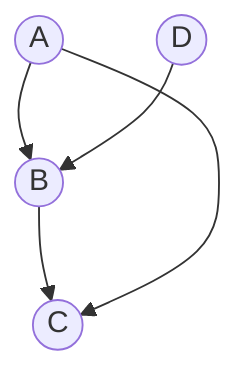
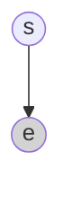

该笔记主要介绍概率图模型贝叶斯网络的local CPD部分的概率表示
<!-- more -->

## 3.1 review

这里除了给定AD的情况下BC独立；还有一个其他独立性条件即A本身独立于D

对于（2）图的满足条件小于题干的概率条件就是合理的，这里后两个图满足给定AD后B与C独立。左二的图多了一个A和D本身就独立的条件（相较于概率空间）
ps.除了V结构和因果关系以外，其他的时候贝叶斯网络中的箭头只代表有关联

## 3.2 局部概率模型——条件概率该如何表示（CPD)

父节点越多的话，需要给出越多的子节点信息以学习父节点
Rule· CPD：

$\rho1:<a^0,j^0;0.8>$，$\rho2:<a^0,j^1;0.2>$代表a=0时有j=0和j=1两个可能分别对应概率0.8和0.2
相同的图模型可能具体情况不同，节点的local CPD会不一样

## 3.3 some model

### 3.3.1 Noisy-Or Model

举个例子（Noisy-Or Model）：
• The failure rate of CPU is f1

• The failure rate of MEM is f2

• The failure rate of DISK is f3

• The failure rate of POWER is f4

• The failure rate of OS is f5

• The failure rate of other events is f0

• Question: the failure rate of your computer?
所有都正常工作的情况是：
（1-f0)* (1-f1)* …… （1-f5) 

在这个模型下，不同的父节点会导致同一个子节点结果

### 3.3.2 The Generalized Linear Models

$$
sigmoid(s)=\frac{e^s}{1+e^s}
$$
Logistic CPD:
$$
P(Y=y^1 | X_1,……,X_k)=sigmoid(w_0+\sum w_i X_i)
$$

y受影响的是后是由父节点的线性组合+套壳（高斯分布、泊松分布）来实现的

在神经网络里这一套也很不自觉的使用，每一个神经元的input就是上一层父节点的权重和（$w_0+\sum w_iX_i$)——父节点数+1才是参数量（因为要考虑$w_0$)

第一层没有父节点，所以是3x1个参数
第二层每个节点有三个父节点权重+w_0权重，所以每个节点都是四个参数，四个节点有4x4个参数
第三层每个节点有四个父节点权重+一个w_0权重，所以每个节点都是5个参数，共有2x5个参数
所以共计:3x1+4x4+2x5

### 3.3.3 Pooling Function

max pooling 具有平移稳定性；median pooling是为了抗噪声

## 3.4 贝叶斯网络图形化示例

eg1.癌症是一个包含许多不同类型疾病的总称。例如，乳腺癌有四种主要亚型：正常型、基底型、Luminal A型和Luminal B型，它们具有不同的临床结果。每种亚型都有不同的基因表达模式。我们需要根据观察到的基因表达来推断亚型。

**首先确定变量：**
Variables: subtypes (s), gene expressions (e)
**第二步需要确定随机变量之间的关系：**
subtypes define the patterns of expressions

方框代表独立同分布的重复结构，重复N次只需要在右下角写一个N
现在已经建立了贝叶斯网络。在local CPD之前建议先检查一下贝叶斯网络
**现在需要确定local CPD**

假定s的local CPD是满足多项式的分布，e在s条件下满足高斯分布，需要注意的是$\pi$等参数并不是节点，不需要画圈
此时就可以联合local CPD和bayesian network来写出complete 概率模型
$$
p\left(s=k,e\right)=P\left(s=k\right)p\left(e\mid s=k\right)\\=\pi_k\times\frac{\exp\left(-\frac12\left(e-\mu_k\right)^T\Sigma_k^{-1}\left(e-\mu_k\right)\right)}{\sqrt{\left(2\pi\right)^k\left|\Sigma_k\right|}}
$$

对于每个单元：
$$
p(S, E)=\prod_{n=1}^N p(s[n]=k, \boldsymbol{e}[n])
$$

eg2.癌症通常是由独立的驱动过程（因素）引起的，例如持续的增殖、抵抗细胞死亡、免疫逃逸和促进血管生长等。
• 这些驱动过程对基因表达模式有联合影响。
• 我们希望基于大规模基因表达数据集推断出这些驱动过程。

首先确定变量：
driving factors ($z_i$ ), gene expressions ($e_j$ )
其次确定关系
z determines the distribution of e
建模：

eg3. 更复杂化的就是参数也是随机变量由其他参数决定

## 3.4 conclusion

Three Steps for Representation：
• Define nodes / variables
• Consider edges / dependences
• Choose local CPDs

