## 1 Intro

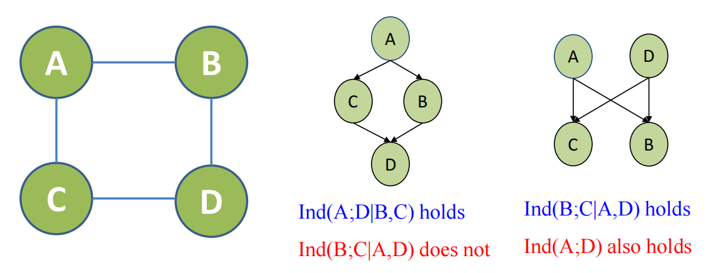
左图的独立性，在右边的独立性是不能完全阐释的——或者说在从无向变成有向的时候，节点之间的独立性发生了转化

在左图中是有ind（A,D|B,C)和ind（B,C|A,D)

## 2 Markov Networks

对于上述的情景，节点之间的相互作用是没有方向的，所以应该用无向图（也称为马尔可夫网络）来建模
在无向图中，节点代表随机变量，如果两个节点没有路径才说明这两个节点是独立的
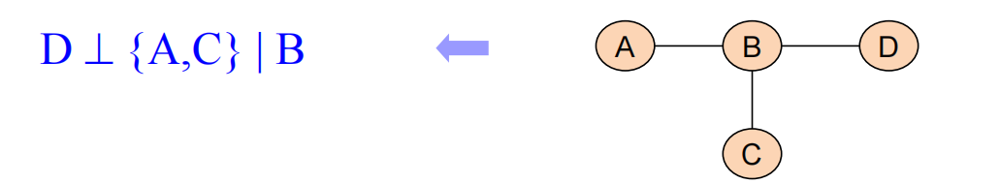

在上述这个图中，给定B相当与在BD之间的路径斩断，D就和A与C没有任何路径联通了，也就是此时D与A和C独立
Markov性就是给定领域之后就和其他节点没有关系了，由于上述的网络具备这个性质，所以称之为**Markov Networks**（在物理里则称之为**Markov random field**）
无向图的特殊结构就是多边形（大于三个节点），贝叶斯网络的特殊结构则是V-structure

对于无向图这类相互作用的建模来说，需要给出的状态之间的相互作用，不要求像贝叶斯网络一样和为1给出概率的形式

Gibbs 分布：用于描述上述的local factors（最开始源自于上述描述分子状态的问题）——需要定义在clique上
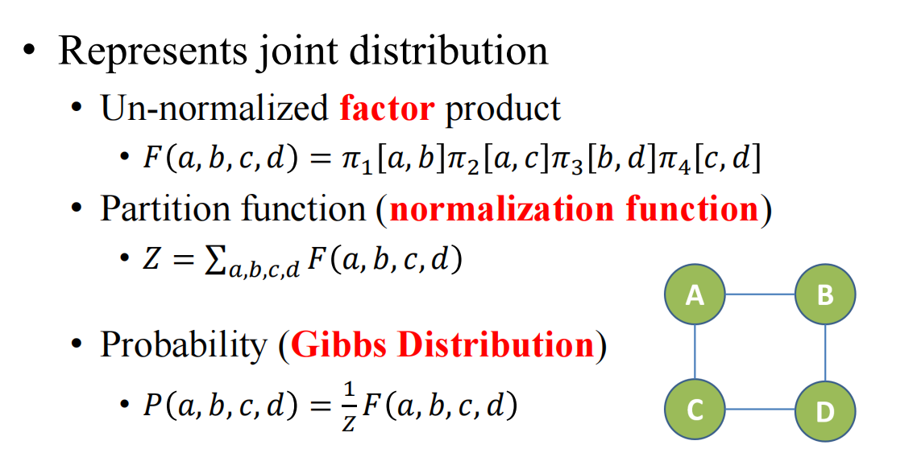

这里的$\pi[a,b]$就是AB这组factor之间的相互影响情况。
在求出F之后需要进行归一化
P(a,b,c,d)就是用于描述这个abcd系统在给定场里的物理状态

图的基本结构就是cliques，要全联通的

> 在马尔可夫网络（Markov Network）中，基本单元称为团（cliques）。这是指图中任意两个节点都直接连接的最大完全子图。具体来说：
> 1. **团的定义**：
    - 一个团是一个子图，其中每对节点之间都有边连接。
    - 最大团是图中不能再扩展的完全子图。
 2. **马尔可夫网络中的角色**：
    
    - 团用于定义联合概率分布。
    - 每个团关联一个势函数，用于表示节点之间的相互作用。
    - 势函数不直接是概率，但用于计算概率分布。
>团在马尔可夫网络中用于捕捉局部依赖关系，帮助构建联合概率分布。

在无向图里，我们需要关注极大完全子图（maximal cliques）——多个大子图
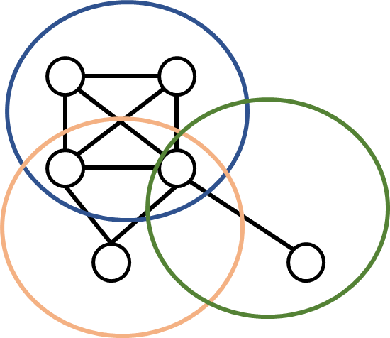

例如在上述的无向图中，有三个极大子图分别是蓝色绿色和橘色的圈，最大子图是蓝色圈
在进行因子分解的时候需要用高阶的大子图而不能全用低阶的如边去构成factors
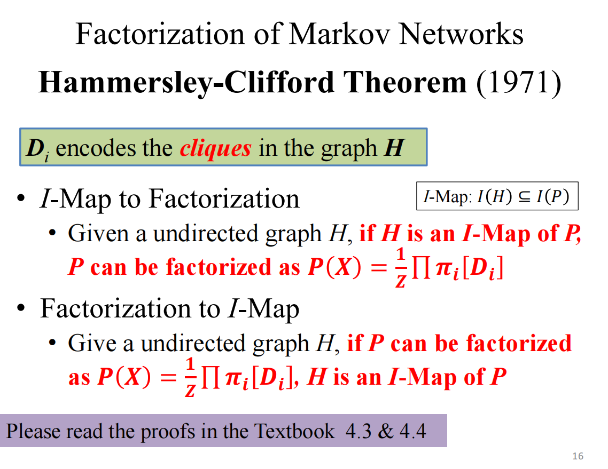
正推是看图说话，反推是结构学习

给定一个图H，其中有若干个cliques D1,……Dn，且factors定义在cliques上：
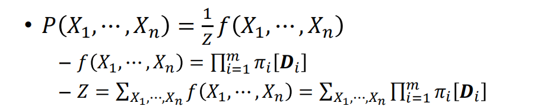
这里的Z是分布函数（Partition function or so called total energy)
例如对于下述的网络，只有两种factors，分别时点和边：
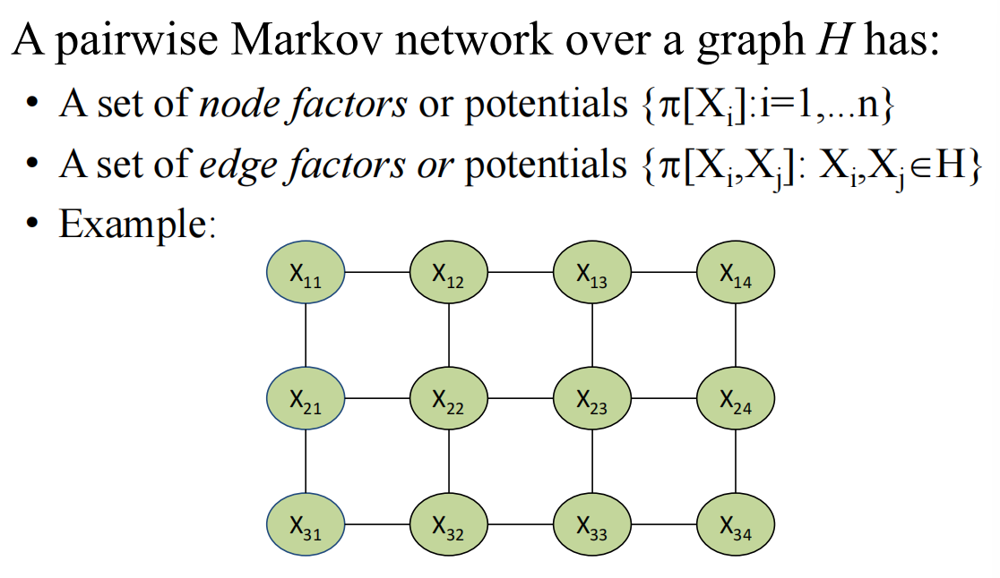
$$
P=\frac{1}{Z}\ (\Pi_i \ \pi[X_i] )\ (\Pi_i \ \pi[X_i,X_j])
$$
乘积在求导的时候不方便，所以往往会变成取对数的方式来实现乘积变成线性（需要结合物理情景来理解里面的负号）
$$
𝜋[𝑫] = exp( −𝜀[𝑫])\ where \ 𝜀[𝑫] = −ln[𝜋[𝑫]]
$$
那么可以把联合概率转化为：
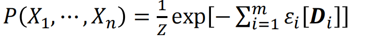

在无向图中很多情况下不关心绝对值，而关心相对值（这是因为分布函数需要对这么多内容求和，求和是很难求总和的，所以想用其他状态/基态的方式来消除z的求和困难）

这个定理给出了Π的形式（构造性的解)
需要满足H是正概率分布的I-Map
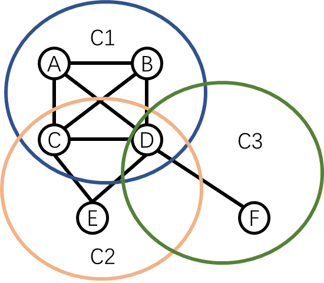
$$
Q=(α_a a+……+\alpha_ff)+(\beta_{ab}ab+……+\beta_{df}df)
+(\gamma_{cde}cde+\gamma_{abc}abc+……+\gamma{bcd}bcd)
+\mu_{a,b,c,d}abcd
$$
此时$$P=1/z*exp(-Q)$$

这里的Z：
$$
Z=\sum_{A,B,C,D,E}exp(-U)
$$
(U=-Q，用U时为了和能量函数所匹配)

## 3 Continuous Variables

多元高斯分布可以通过对应随机变量的协方差为0来直接得到其完全独立
更常见的情况时协方差矩阵为0的地方，当且仅当x和j之间没有直接的边——也就是可以根据求解信息矩阵一下就可以画出高斯随机场的拓扑结构
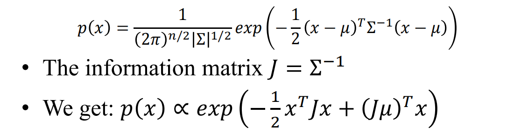
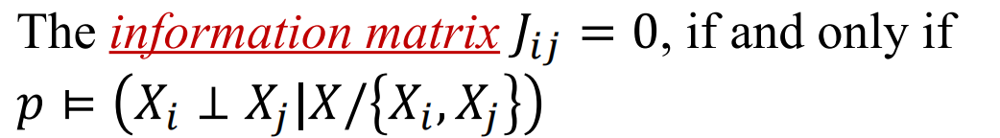

