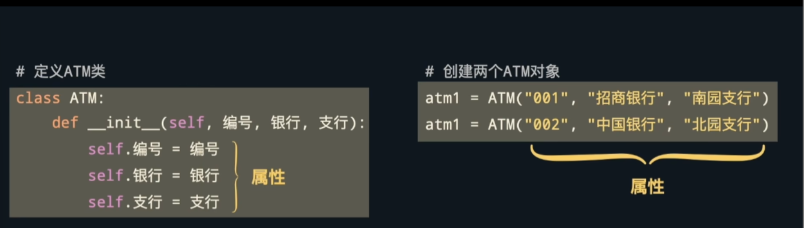
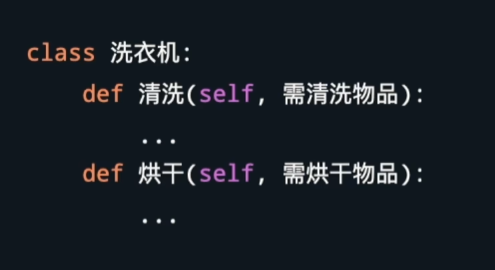
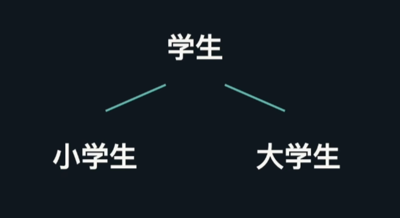
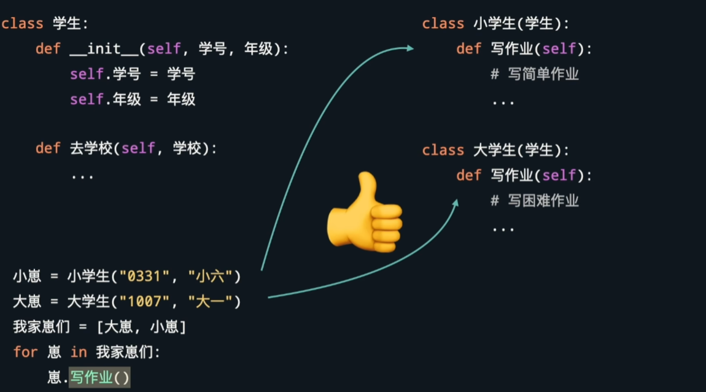
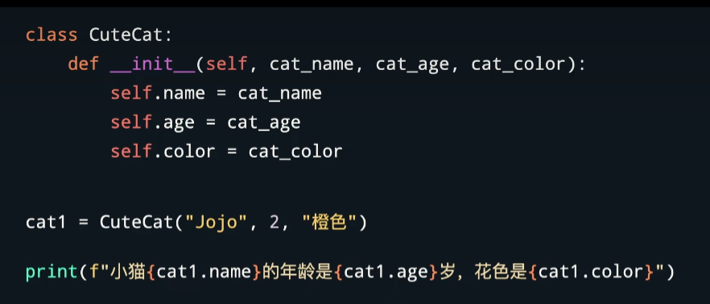
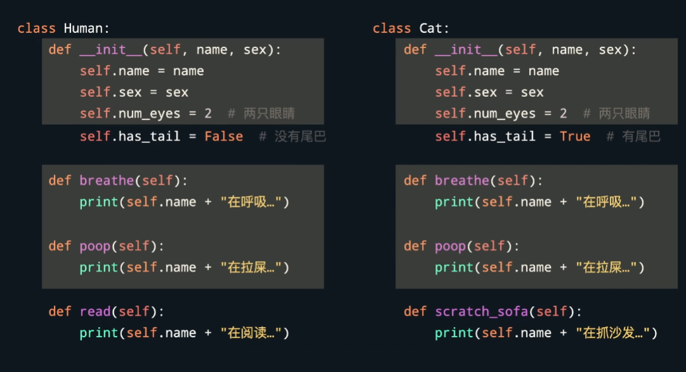
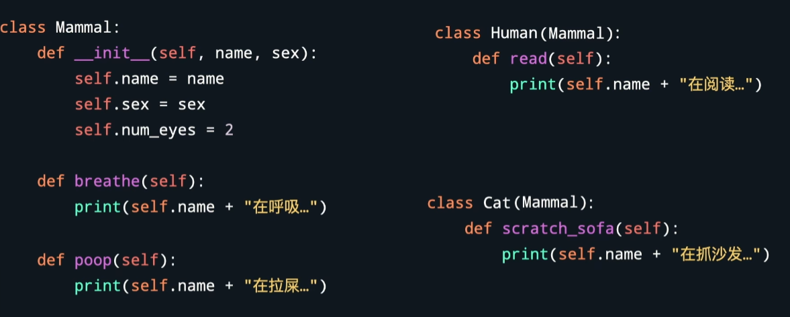
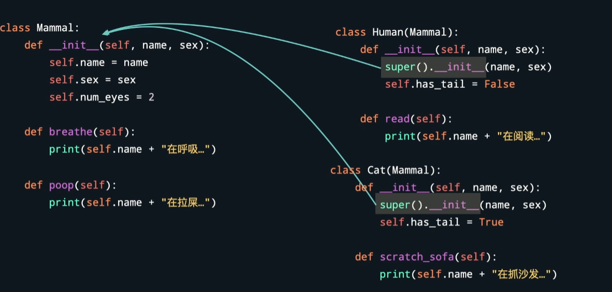
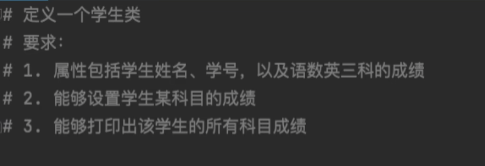
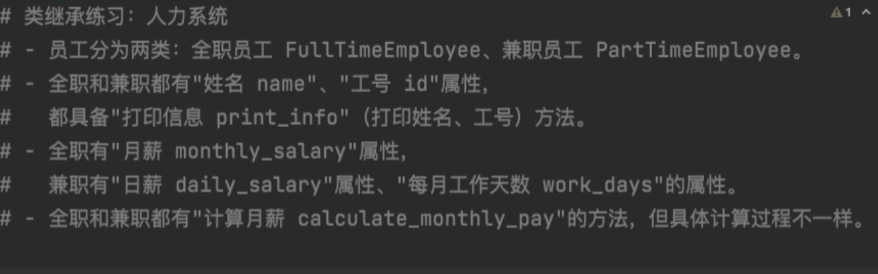

该笔记主要学习python中的面向对象编程，主要包括类的创建、对象的创建、类的改进、定义对象的方法、面向对象的继承等内容。
学习来源主要是[3小时快速入门Python](https://www.bilibili.com/video/BV1944y1x7SW?p=29&vd_source=86b2402290f7b7dee927bba58a141a81)，并且在学习过程中加入了一些自己的理解和总结。

<!-- more -->

# Object-Oriented Programming

## 1 面向对象的原理与概念

面向过程是把要实现的事情按照实现顺序依次定义步骤，然后按步骤编程——随着程序需要解决的复杂度增加代码复杂性降低

面向对象编程：关注属性和功能

定义类——类中有实例

**关注属性：**

例如可以假设一个类叫做atm



那么atme类里可以有很多的对象，比如atm1是招商银行南园支行的atm，而atm2是中国银行北园支行。这样使得数据的流动更加清晰

**关注功能：**



定义好洗衣机的功能之后，可以直接调用洗衣机的功能


除此之外面向对象还有封装继承多态等好处

封装比较容易理解，举个简单的例子就是，定义好洗衣机类之后，只需要调用其中的功能即可，不需要再研究洗衣机类具体的功能是怎么实现的

继承则是由于可能不同的类有大量重复属性，比如小学生类和大学生类都是学生，都得考试和做作业，那么我们不妨定义一个大类“学生”，学生大类下有小学生，有大学生




多态则是指同样的接口可能实现方法不同，比如定义学生类，都得写作业，但是对大学生写作业的方法和小学生写作业方法可能不同，也就是说，写作业这个功能有多个实现模式——小学生写作业模式、大学生写作业模式，我们在定义好后，只要确定我的学生是小学生还是大学生然后直接调用写作业就行了——此时由于学生所属的类不同就会自己调用不同的做作业方法



## 2 类的创建

### 2.1 类的命名

类不能含有下划线，格式为：
```
class 类名:
# 类名建议采用驼峰命名法，不带任何的下划线等特殊字符
```

例如：

```
class CuteCat:
	#接下来是定义类的代码
```

### 2.2 类的创建

对于类有一个特殊方法是构造函数，用于定义实例对象的属性，必须被命名为\__init__ ,形如：

```python
class CuteCat
	def __init__(self)
    	#接下来是构造函数的代码
```

对于\__init__,第一个参数必须是self——约定俗称的，表示第一个参数被占用，表示对象自身。self的作用就是把属性的值绑定在实例对象上

例如

```python
class CuteCat
	def __init__(self)
    	self.name="大黄"
```

这表示猫猫的名字属性是大黄（也就是这只猫叫做大黄），那么通过 `self.name="大黄"`就把猫叫大黄的名字绑在这只猫上了。

如果写成`name="大黄"`则python认为只是给变量name赋值罢了

## 3 对象的创建

在创建了猫这个类之后，我们可以创建一只猫猫对象

首先我们复习创建类

```python
class CuteCat:
    def __init__(self):
        self.name="大黄"
```

创建好类之后，我们开始创建对象

```python
cat1=CuteCat()
```

此时就创建了一个叫做大黄的猫猫对象

格式上就是：

```python
对象=类名（参数）
```

这样init方法就会被调用，同时返回一个对象。self参数不需要手动传入，可以自动运行传入

## 4 类的改进

上述创建的类里所有猫都叫大黄，这明显就不合适，所以我们可以把这个类进行一些修改和改进

```python
class CuteCat：
	def __init__(self,cat_name):
        self.name=cat_name
```

这样，我们创建对象时，就需要在括号里传入参数

例如创建一个叫小黑的猫猫对象

```python
cat1=CuteCat("小黑")
```

在此基础上添加更多的参数也就很简单了，例如：



## 5 定义对象的方法——也就是定义功能

刚刚提到的都是对对象类的属性进行定义，所以我们现在来看怎么实现对功能的定义

对于对功能的定义，其实很简单，可以参考函数的定义，只不过需要写在class里，而且第一个参数被self占用

```python
class CuteCat：
	def __init__(self,cat_name,cat_age):        
    	self.name=cat_name
        self.age=cat_age
	def speak(self):
        print("喵"*self.age)
```

类的功能包含self可以很方便的调用类的属性，比如上述调用的类的年龄属性

那调用功能就很方便了：

```python
# 创建对象
cat1=CuteCat('小红'，18)
cat1.speak()
```


## 6 面向对象的继承

例如对于下面俩类，我们不难发现有不少重复



写代码应该尽可能的少重复，因此我们可以创建一个父类来描述共性



一般来说，子类有调用方法就优先调用自己的方法，如果没有则调用父类

但是这回面临一个问题就是，不同子类可能有不同属性，因此我们需要子类的构造函数来定义子类的属性，但如果用`def __init__`的方法的话，那么由于子类有构造函数，就不会调用父类的构造函数了，那写到父类里的共性就调用不了了

如何解决：

在子类下用super



利用super把父类的属性继承

## 7 习题训练

### 7.1 类的定义



```python
class student:
    def __init__(self,name,id):
    	self.name=name
        self.id=id
        self.grades={"语文",0;"数学",0;"英语",0}
	def set_grade(self,course,grade)
    	if coures in self.grades:
            self.grades[course]=grade
    def print_grade(self)
    	print(self.grades)
        
# 创建对象
xiaochen=student("小陈","12")
xiaochen.set_grade("数学"，95)
```

### 7.2 类的继承



```python
class HumanResourcesSystem:
    def __init__(self,name,id):
    	self.name=name
        self.id=id
    def print_info(self):
        print("姓名为",self.name)
        print("id为",self.id)
class FullTimeEmployee(HumanResourcesSystem):
    def __init__(self,name,id,salary):
        super().__init__(name,id)
        self.monthly_salary=salary
	def calculate_monthly_pay(self):
    	#print("月薪为",self.salary)
        return self.salary
class PartTimeEmployee(HumanResourcesSystem):
    def __init__(self,name,id,salary,days):
        super().__init__(name,id)
        self.daily_salary=salary
        self.work_days=days
	def calculate_monthly_pay(self):    
        #print("月薪",self.work_days*self.daily_salary)
        return self.work_days*self.daily_salary
```


## 其他：

1. [设计模式目录——23种设计模式](https://refactoringguru.cn/design-patterns/catalog)
2. [3小时快速入门Python](https://www.bilibili.com/video/BV1944y1x7SW?p=29&vd_source=86b2402290f7b7dee927bba58a141a81)
3. [matlab面向对象程序设计]("D:\Lab\Books\matlab面向对象.pdf")

