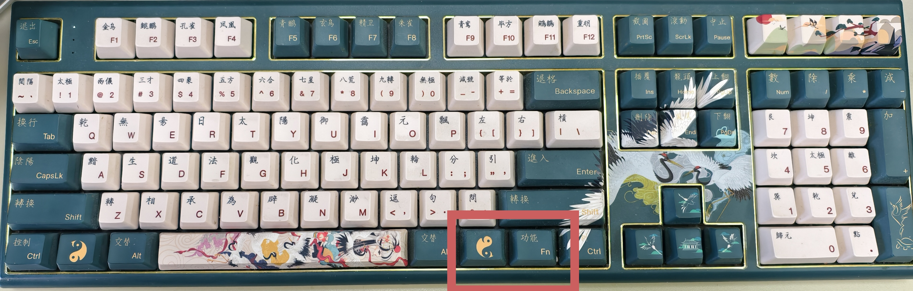
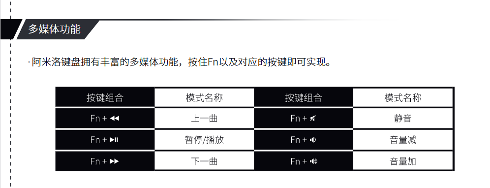
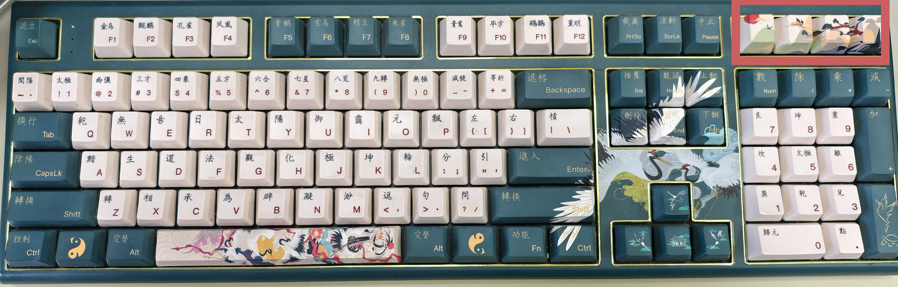

该笔记主要介绍varmilo keyboard 的一些常见的键位使用
<!-- more -->
## 0 背景
作者于2024年购置了一个阿米洛花旦娘的红轴机械键盘，在购买的时候就被键盘出色的外观和习惯的红轴所打动，但在近一年的使用过程中却遇到了许多的问题，包括但不限于win键突然没响应（笔记本的win键依然可以使用），整个机械键盘被锁定，不知道在哪播放/暂停/切歌、增加/减小音量、镜音，右上角的四个按键分别对应什么等等的问题，在翻阅互联网后也没有解决其中的一些问题，于是今天又特意询问了客服才解决。  
为了避免之后忘记以及方便网友们使用，故写了一篇notes来记录该键盘的使用   

## 1 键盘锁定
与cherry的红轴mx250键盘等键盘不同，阿米洛的键盘音量键调节并不在`Fn`+`F2`上，因此当作者数次尝试`Fn`+`F2`的结果都是机械键盘直接锁定无法使用。  

出现键盘锁定的情况时，左上角三个指示灯中的第一个会熄灭，这时要解决这个问题只需按住`Fn`+`Del`即可  

## 2 win键失灵

作为重度win键使用者，win键失灵为我带来了极大的不便（谁家好人桌面没有app，app全收录到了win键菜单里），触发win键失灵（或者说锁定win键）的方法很简单，按住`Fn`和其右边的win键就行：  

当然，一般情况下触发都非常的偶然，所以要解锁也只需要按上图红色框中的两个键即可（先按住`Fn`再按住win）  

## 3 音量调节与播放控制

我对于阿米洛花旦娘键盘唯一不满的地方就是这些功能键并没有标注，以至于每次按`Fn`都是生死难料，而阿米洛的说明书也很草率：  

这上面的播放键这些到底是哪个呢？  

在此，笔者重新编写了上述的表格，以便日常使用：  

| 按键组合   | 结果      |
| ---------- | --------- |
| `Fn`+`F7`  | 上一首    |
| `Fn`+`F8`  | 暂停/播放 |
| `Fn`+`F9`  | 下一首    |
| `Fn`+`F10` | 静音      |
| `Fn`+`F11` | 音量降低  |
| `Fn`+`F12` | 音量增加  |

## 4 功能键使用说明

键盘右上角的四个按钮从左到右依次的功能为：

| 按键位置                | 功能           |
| ----------------------- | -------------- |
| `右上角左数第1个功能键` | 打开播放器     |
| `右上角左数第2个功能键` | 打开浏览器     |
| `右上角左数第3个功能键` | 打开计算器     |
| `右上角左数第4个功能键` | 打开文件管理器 |

## 5 附录

官网说明书地址：[阿米洛VBS108说明书](https://wds-service-1258344699.file.myqcloud.com/20/18065/pdf/17332758789244eac810e6ad3cdfd282becde094ff070.pdf)
