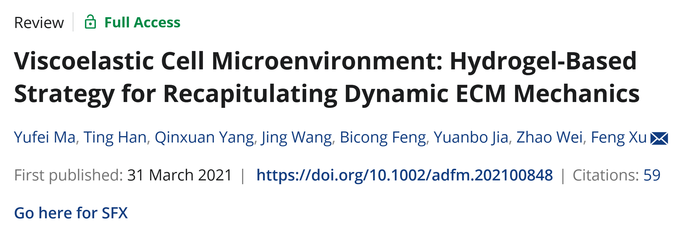
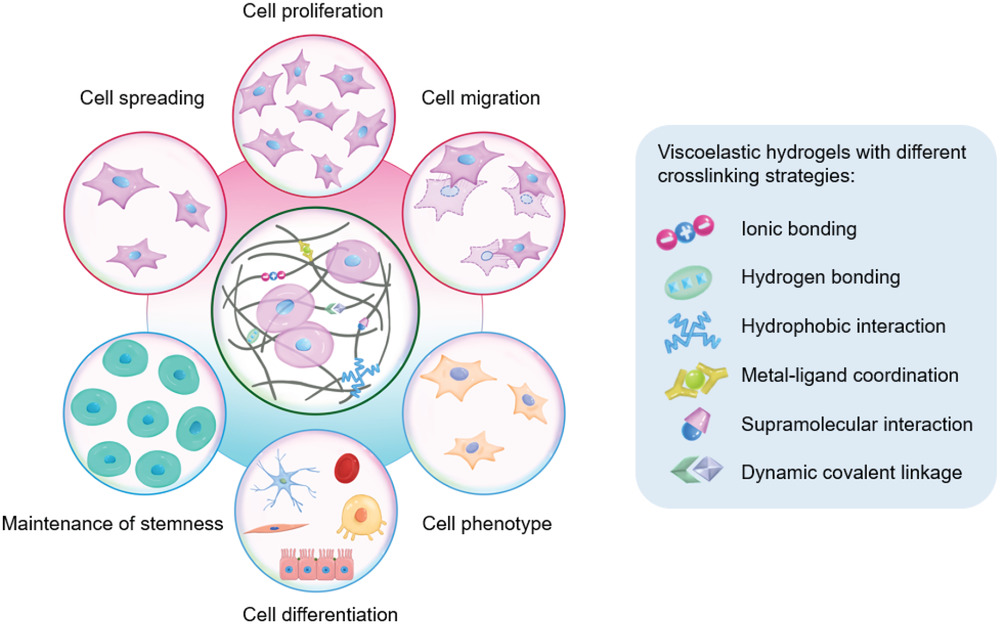
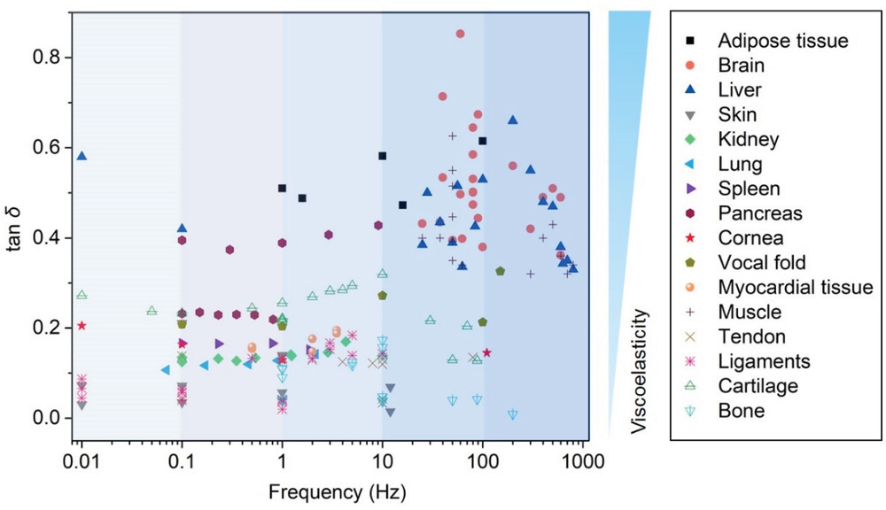
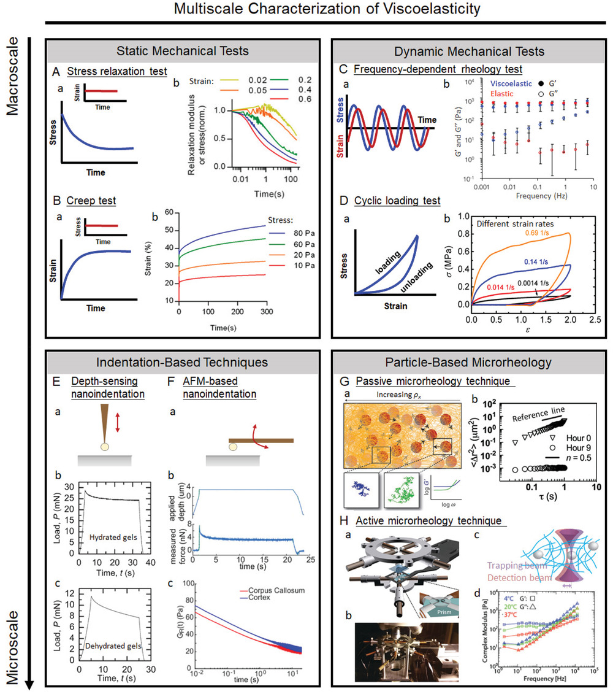
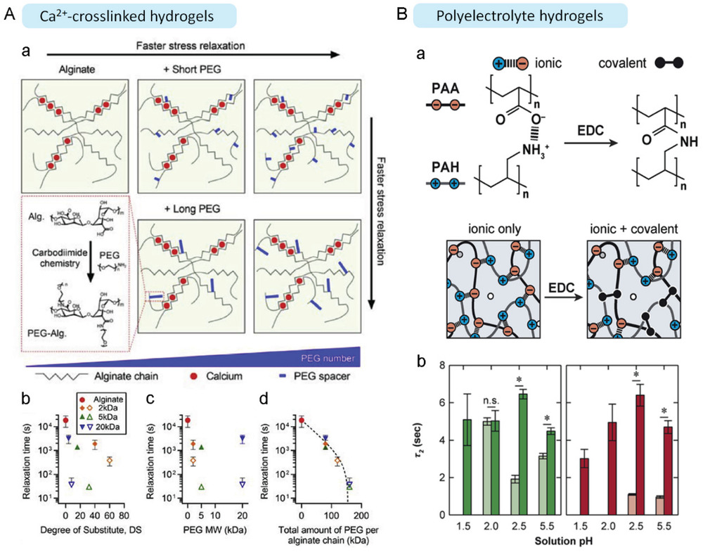
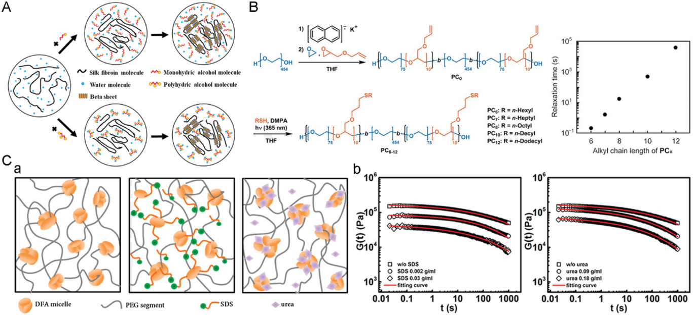

该笔记主要介绍AFM的Viscoelastic Cell Microenvironment: Hydrogel-Based Strategy for Recapitulating Dynamic ECM Mechanics这篇文章
<!-- more -->

## 1 overview

doi is here : https://doi.org/10.1002/adfm.202100848

## 2 abstract

本地细胞外基质（ECM）通常表现出动态的机械性能，并以粘弹性行为（例如，应力松弛和蠕变）表示对变形或机械载荷的时间依赖性响应。 

ECM的粘弹性在发育，稳态和组织再生中起着至关重要的作用，并且最近也认识到其在疾病进展中的影响。具有可调粘弹性特性的水凝胶具有巨大的希望，可以概括本天然ECM中发现的时间依赖性力学，这些力学最近被用于调节细胞行为和指导细胞命运。

在这里，组织粘弹性的重要性首先突出显示，汇总了**水凝胶粘弹性的分子机制**，并**回顾了宏观和微观计算中使用的表征技术**。然后，通过各种交联策略，粘弹性细胞微环境的工程技术及其对细胞行为和命运的实质性影响，并随后讨论了基本的机械生物学机制，从而通过不同的交联策略，粘弹性细胞微环境的工程进行工程进行了可调的粘弹性的最新进展进行了讨论。最后，提出了关于粘弹性水凝胶的设计和调制的持续挑战和未来观点以及对粘弹性细胞微环境的细胞反应的机械生物学机制。

> **comments:** 
>
> Here the importance of tissue viscoelasticity is first highlighted, the molecular mechanisms of hydrogel viscoelasticity are summarized, and characterization techniques used at the macroscale and microscale are reviewed. 
>
> 这里的first用的容易被审稿人怼（风险用词，有点过于吹了）

## 3 details

介绍细胞相互作用的一些常见类型（细胞分化，迁徙etc），以及一些常见的作用力包括离子键，氢键，金属配体相互作用，动态共价键等等

这里的$\tan\ \delta$是储能模量和损耗模量的比值，做了一个类似于各个组织器官粘弹性的分布图

这里比较好的就在于这里总结了从macroscale到micro scale的一些表征方式，以及active and passive的方式

关于水凝胶还有一些好玩的：

比如钙离子的调控交联/尿素对水凝胶网络的影响

