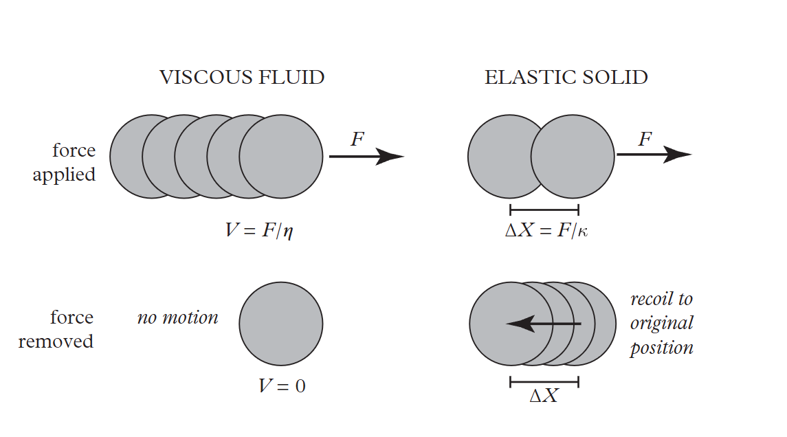
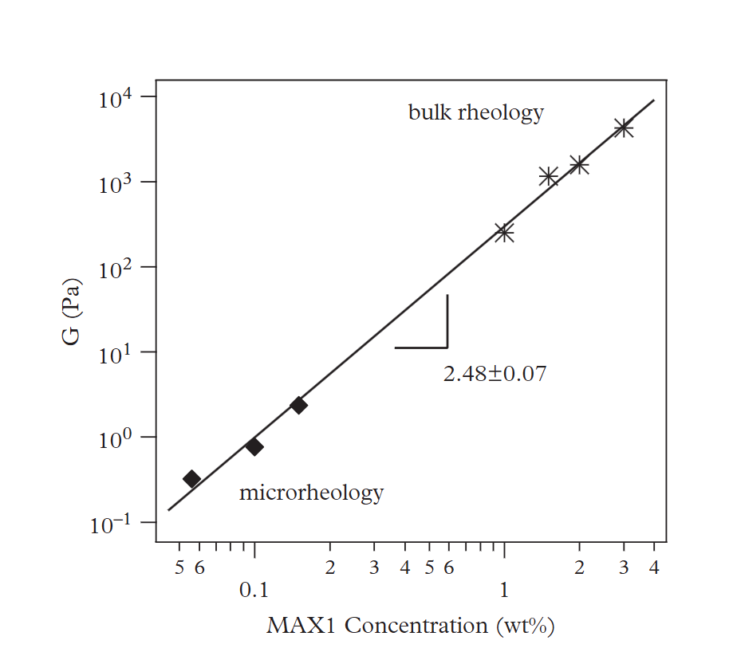
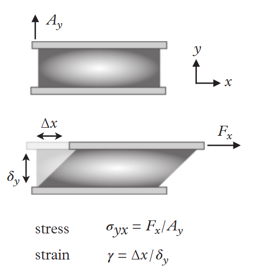
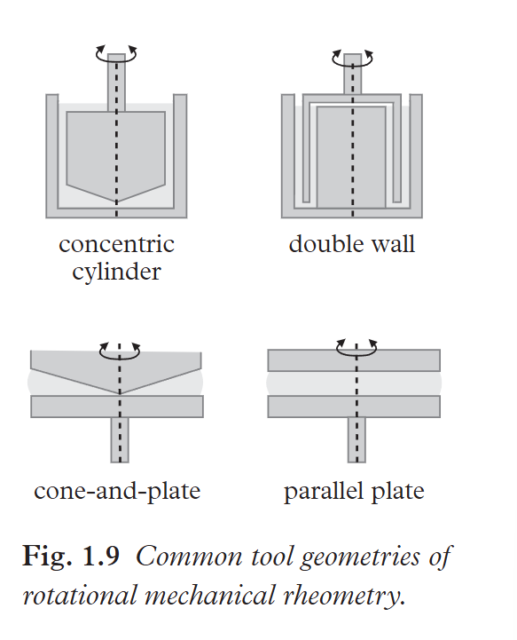

该笔记主要介绍Microrheology by Eric M. Furst (Author), Todd M. Squires (Author)一书，本note是该书introduction部分的笔记
<!-- more -->

## Microrheology

微流变学是一类表征材料的流变学的工具，常见的微流变的特征包括弹性和粘性，一般两者的表现呈现出如下图所示的特点：

可以发现，对于纯viscous fluid来说，粒子经过外界里产生位移之后，如果外界力撤去那么粒子就停留在被力拉扯后的位置了；而对于elastic solid而言，如果外界力撤销，那么粒子则会回到最初的位置。

当然，现实中可能的流体既有viscous又有elastic，所以因此也产生了viscoelastic。

### Active and passive microrheology

微流变早期的测量方式主要呈现出以下特征：测量探针粒子嵌入在材料中，在响应力时的运动，进而推断材料的响应特性

当有外界的例如magnetic或者gravitational or centrifugal 相互作用对粒子产生扰动的时候，这就是active的微流变学; 相反，如果没有，则是被动微流变学。

> 题外话：TG Mason居然是被动微流变的祖师爷级别的存在
>
> The other class, called passive microrheology, is a
> more recent development, and began with the seminal work of Mason
> and Weitz (1995) and Gittes et al. (1997)

被动微流变学采用极小的微流变探针颗粒（通常仅为微米或更小尺寸），其热波动足够强烈，能够驱动探针产生可测量的运动。这种运动源于周围分子持续的热波动轰击，使探针在环境中产生随机运动。由于受到这些随机力的作用，颗粒会在不同方向和强度的作用下运动，且这一过程涵盖了多个时间尺度。随机力的大小以及颗粒对这些力的响应方式取决于材料的特性。在粘性流体中，被随机力驱动的颗粒通常沿着受力方向产生漂移，其运动轨迹表现为带有平均位移的扩散行为。

**可以认为在粘性流体中，颗粒主要被随机力驱动沿着受力方向产生漂移？**
$$
<\Delta x^2(t)>=2Dt\\
$$

$$
\zeta = 6 \pi a \eta
$$

Stokes计算了流体动力抗性ζ，如（2）。

结合爱因斯坦和斯图克斯可以得到：
$$
D = \frac{k_B T}{6 \pi a \eta}
$$

### 局限与优势

**局限：**

微流变学从一开始就存在一些重要的局限性：其核心技术依赖于追踪材料中小颗粒的运动，因此，这种方法仅适用于**相对柔软的材料**，其模量通常不超过**几百pa**（相当于果冻的刚度）或流动性高于蜂蜜的液体。

**优势：** 小样品量，数据获取容易，灵敏，拓展到频域，原位（Local rheology），实验简单

微流变学适合小批量，低模量的样品，而大量流变学则更适用于高浓度和高模量的材料。

### 线性与非线性微流变

剪切应力与应变如上图所示，其中$A_y$是作用面积

如果板间材料为弹性固体，则在施加给定应力后，应变会达到稳定值，不再变化。而如果材料是粘性液体，应变会随时间持续增加，表现为材料不断变形，此时板将以剪切速率 **γ = σ / η** 向右移动。两种行为类似于图 1.1 中探针颗粒的运动方式，分别对应于弹性与粘性特性的力学响应。

**线性响应**： 反映的是材料在偏离平衡态下的微响应（类似于处于平衡的体系被微扰后偏离平衡，然后经过线性响应逐渐回到平衡状态）

**非线性响应**：这往往对应着的是材料收到的应力超过了线性响应区域，进一步的应力导致材料内部的结构发生破坏

Cox – Merz规则是与频率相关的复杂粘度有关的经验关系：
$$
\eta^*(\omega) = \frac{G^*(\omega)}{i\omega}
$$
线性响应的测量参见书本的1.2.2

### 复数剪切模量G*

一般可以通过流变仪施加震荡应变：
$$
\gamma(t) = \gamma_0 e^{i\omega t}
$$
那么材料会对震荡应变产生响应，进而产生应力：
$$
\sigma(t) = \sigma_0 e^{i(\omega t + \delta)}
$$
进而根据应力和应变得到频率依赖的复数剪切模量：
$$
G^*(\omega) = \frac{\sigma(t)}{\gamma(t)} = \frac{\sigma_0 e^{i\delta}}{\gamma_0}
$$
一般而言会将复数剪切模量分成实部和虚部：
$$
G^*(\omega) = G'(\omega) + iG''(\omega)
$$
其中，弹性（储能）模量 $G'(\omega)$；粘性（损耗）模量 $G''(\omega)$

储能模量描述了材料在特定频率下发生弹性形变所需的（可恢复的）能量。如果 $G'(\omega)$ 较高，说明材料的弹性行为占主导，类似于固体。

损耗模量描述了材料在特定频率下发生粘性流动时（不可恢复的）能量损耗。如果 $G''(\omega)$较高，说明材料的粘性行为占主导，类似于液体。

除此之外还有相位角：
$$
\tan \delta(\omega) = \frac{G''(\omega)}{G'(\omega)}
$$
纯弹性材料的$δ= 0$范围，其应力随应变而变化，而粘性流体的$δ=π/2$的变化，其应力为90度，与施加的应变（当然，这意味着，这意味着，这意味着，这意味着$tanδ$的差异为$g'→0$）

## 胶体（Colloidal）粒子

本节主要回顾胶体粒子的物理化学特性

### 作为探针的胶体粒子

胶体粒子作为探针，需要满足以下的三个特征：

- 颗粒尺寸和形状具有均匀性
- 探针要具有稳定性，避免化学降解；同时还需要均匀的分散于介质中反映局部的微流变特性（分散性）
- 表面化学的惰性（避免探针颗粒引入后改变待测介质的原始性质）

