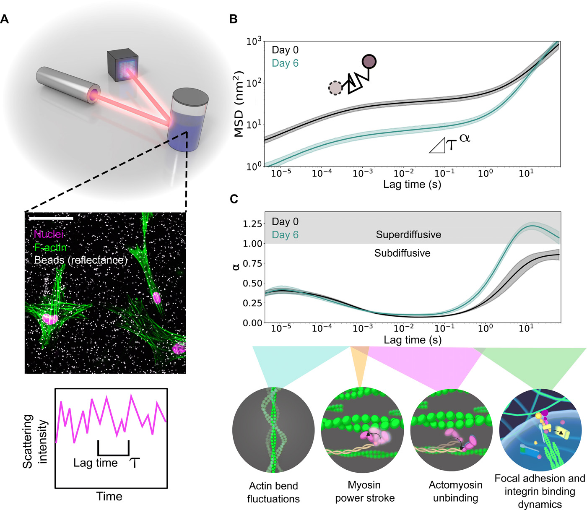
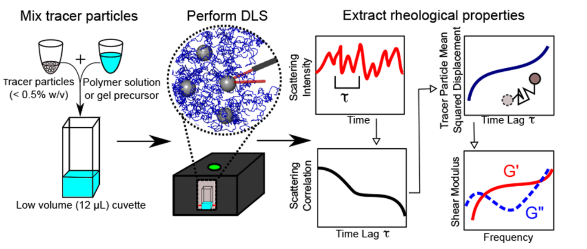
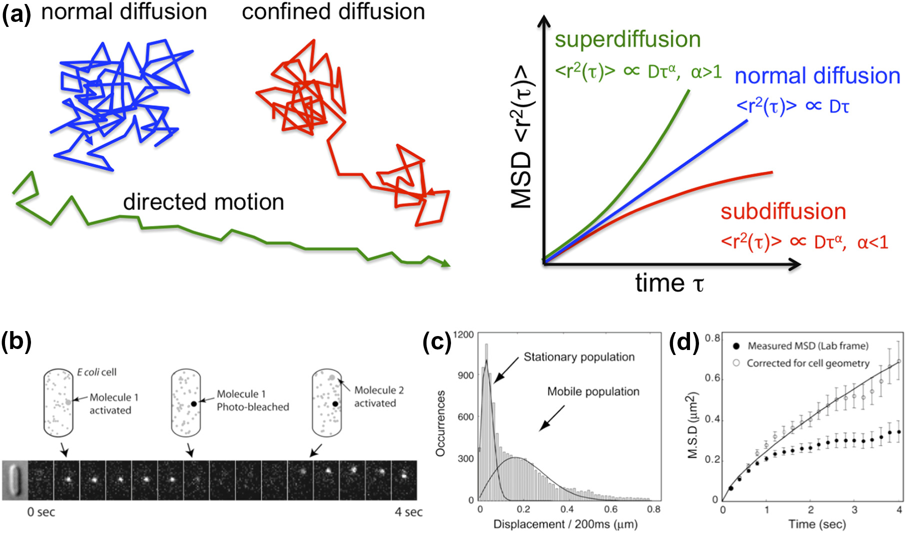
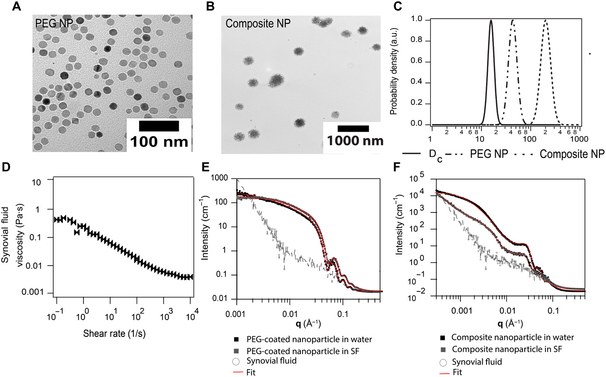

该笔记主要介绍基于颗粒的粘度检测，包括基于动态光散射（DLS）技术的和基于粒子图像示踪的（VPT）。本文将从理论和实际计算等部分依次详细介绍和整理。
<!-- more -->

## 基于颗粒实现粘度检测

基于颗粒的粘弹性检测是一种被动微流变技术，通过在待测体系中引入示踪粒子，利用成像或散射检测系统追踪粒子的布朗运动或散射光强变化。随后，通过分析粒子的运动轨迹或自相关函数，计算其扩散系数，并结合斯托克斯-爱因斯坦公式精确推导体系的粘度（viscosity， $\eta$）。

例如，在动态光散射技术中，通过检测探针粒子散射光强的时间变化，计算其均方位移（Mean Squared Displacement, MSD）：

> B. A. Krajina *et al.*, *Science Advances*. **7**, eabe1969 (2021).

> B. A. Krajina *et al.*, *ACS Cent. Sci.* **3**, 1294–1303 (2017).

而在粒子图像示踪中，则直接根据粒子的轨迹信息计算均方位移

通过MSD拟合得到扩散系数D和$\alpha$:
$$
<r^2(t)>=4Dt^\alpha
$$

> *Journal of Molecular Biology*. **430**, 4443–4455 (2018).

然后根据利用扩散系数得到粘度：
$$
\eta_t=\frac{k_B T}{6\pi r_pD_t}\\
\eta_r=\frac{k_B T}{8\pi r_p^3D_r}\\
$$
其中的角标r表示旋转，$\eta_r$是基于旋转扩散系数$D_r$测量的粘度，而$\eta_t$是基于平移扩散系数$D_t$测量出的粘度：

> M. Unni *et al.*, *Science Advances* (2021), doi:[10.1126/sciadv.abf8467](https://doi.org/10.1126/sciadv.abf8467).

