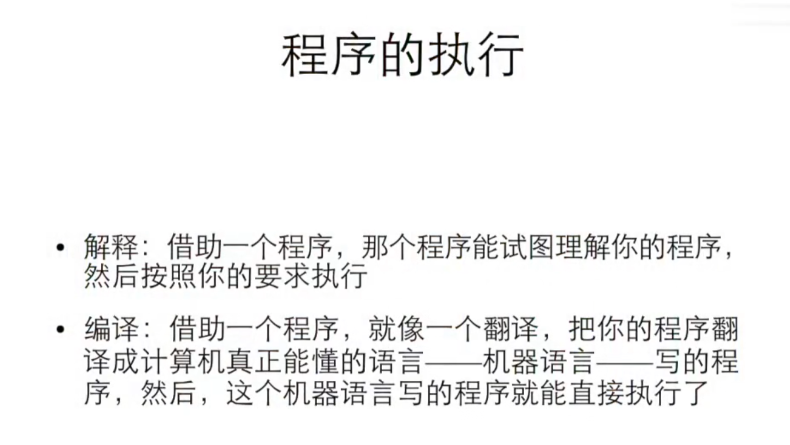

该笔记主要记录浙江大学翁恺的java入门与进阶课程的学习笔记，主要包括第一小节的基础知识内容
<!-- more -->

## 1 计算机基本概念

计算机的常见的一个方法：枚举法

但枚举法往往很慢，为了加速计算往往设计了许多其他的方法，例如二分法等等，或者更加复杂优化的方法

关于程序的执行：

解释器每次根据代码进行逐行执行，而编译器则是根据代码将其编译成机器码，然后直接用机器码运行

需要注意的是，语言的解释和编译是没有具体区分的，只是根据习惯往往会选择比如说python是解释器，c用编译器。

在今天，这两种方式没有很明显的区别。
