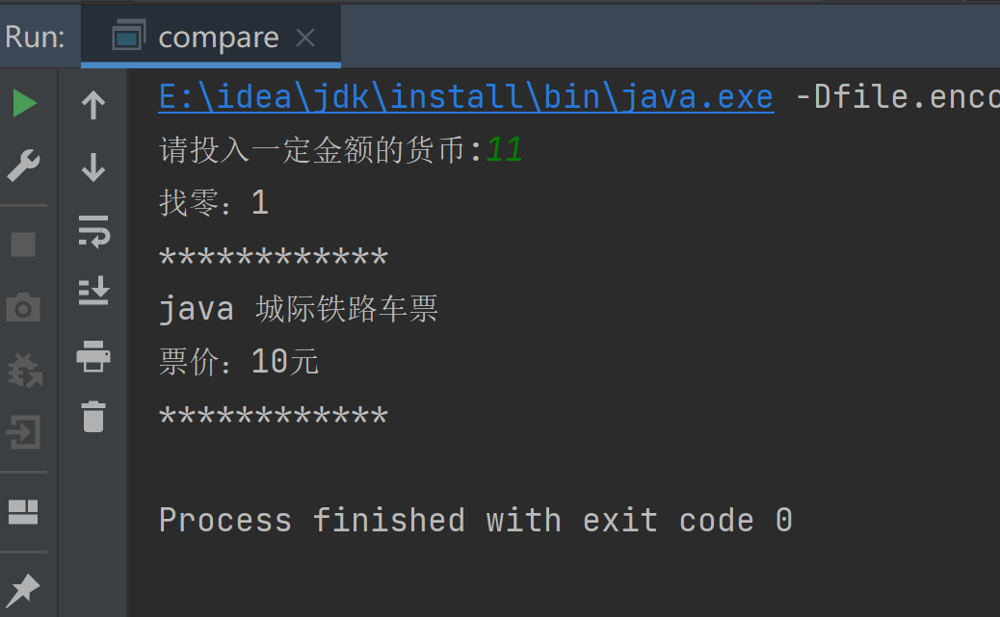
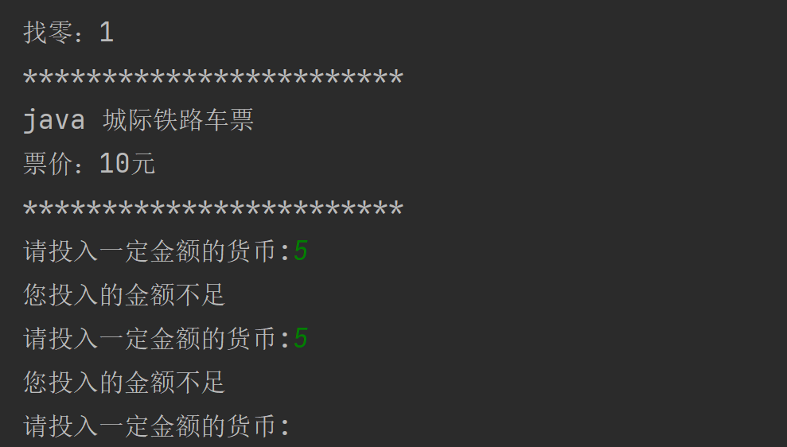
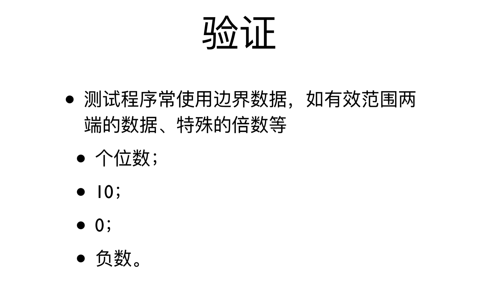

该笔记主要记录浙江大学翁恺的[java入门与进阶课程](https://www.bilibili.com/video/BV1wL411L7A3?p=3)的学习笔记，主要包括第3小节的循环的内容，包括while、do-while等循环的相关知识
<!-- more -->

## 1 循环

对于之前买票的程序，现有的仅能够购买一张票整个程序就结束了，但是实际上应该在现实中是不停的一次次买票，这就需要利用循环的相关知识了：

原有代码如下：

~~~java
import java.util.Scanner;

public class compare {
    public static void main(String[] args) {
        System.out.print("请投入一定金额的货币:");
        Scanner in = new Scanner(System.in);
        int amount=in.nextInt();
        if (amount>=10){
            System.out.println("找零："+(amount-10));
            System.out.println("************************");
            System.out.println("java 城际铁路车票");
            System.out.println("票价：10元");
            System.out.println("************************");
        }
        else {
            System.out.println("您投入的金额不足");
        }
    }
}

~~~

可以看到，只有一次输出车票之后整个系统就结束了，这是并不适合实际使用的：

为了应对这个内容，我们需要让上述过程反复的进行，这时就可以使用while的语句：

~~~
import java.util.Scanner;

public class compare {
    public static void main(String[] args) {
        System.out.print("请投入一定金额的货币:");
        while(True){
            Scanner in = new Scanner(System.in);
            int amount=in.nextInt();
            if (amount>=10){
                System.out.println("找零："+(amount-10));
                System.out.println("************************");
                System.out.println("java 城际铁路车票");
                System.out.println("票价：10元");
                System.out.println("************************");
            }
            else {
                System.out.println("您投入的金额不足");
            }
       }
    }
}

~~~

这是运行的结果：

不难发现，我们的程序面临以下的几个问题，首先是单次金额不足但多次投币后达到金额，却无法购买相应的票，其次是我们的程序永远不会停止

为了应对零钱累计，其实很简单，多增加一个累计的变量就行了：

~~~java
import java.util.Scanner;

public class compare {
    public static void main(String[] args) {
        Scanner in = new Scanner(System.in);
        int balance=0;
        while (true) {
            System.out.print("请投入一定金额的货币:");
            int amount = in.nextInt();
            balance=balance+amount;
            if (balance >= 10) {
                System.out.println("找零：" + (balance - 10));
                System.out.println("************************");
                System.out.println("java 城际铁路车票");
                System.out.println("票价：10元");
                System.out.println("************************");
                balance=0;
            } else {
                System.out.println("您投入的金额不足");
            }
        }
    }
}

~~~

## 2 数数字

~~~
import java.util.Scanner;

public class CountNumber {
    public static void main(String[] args) {
        Scanner in = new Scanner(System.in);
        System.out.println("欢迎来到判断位数");
        System.out.print("请输入需要判断的数: ");
        int amount= in.nextInt();
        int count=0;
        while (amount>0)
        {
            amount=amount/10;
            count=count+1;
        }
        System.out.println(count+"位数");
    }
}

~~~

只需要不停的除以10就可以实现了

这里的`while`后面的括号就是while循环成立的条件，如果条件成立那么循环始终是运行着的。需要注意的是，只有当循环体结束一次之后才会回到判断条件的地方进行下一次循环是否进行的判断

## 3 循环验证

其实不难发现，上述我们的程序对于0以及负数都是不能work的，这是因为对这种情况，input的数连循环体本身的判断条件都不符合，相当于一次循环都没有进行就直接结束了。

## 4 do-while语句

对于上述的情况，我们可以先做一次循环的内容，再进行判断，这时可以使用do-while语句

~~~
do{
	operation;
}while(condition);
~~~

特别需要注意do-while循环里面的while后面的分号