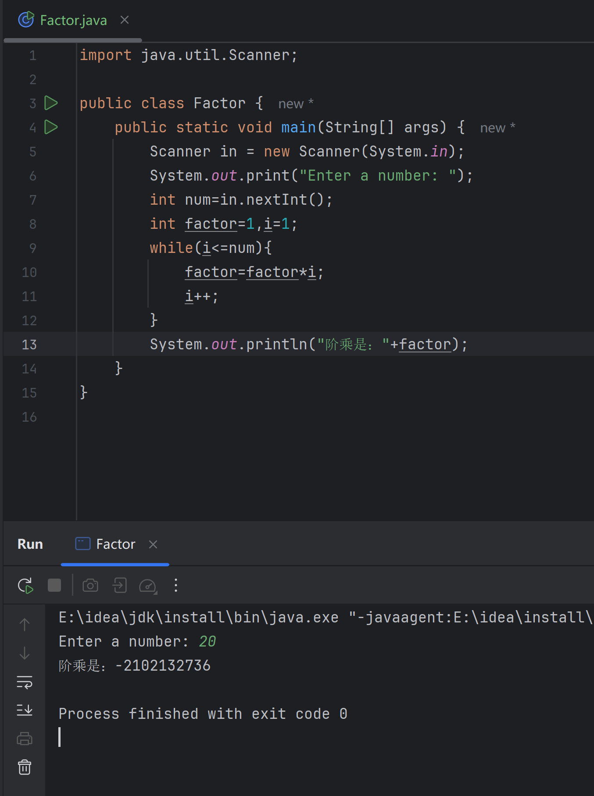
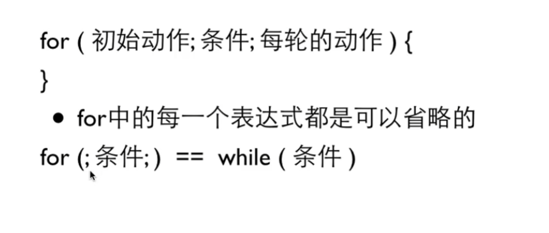
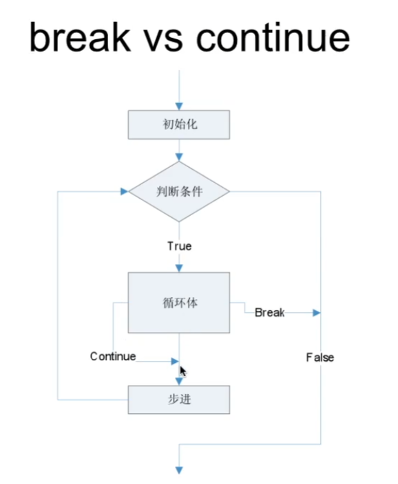
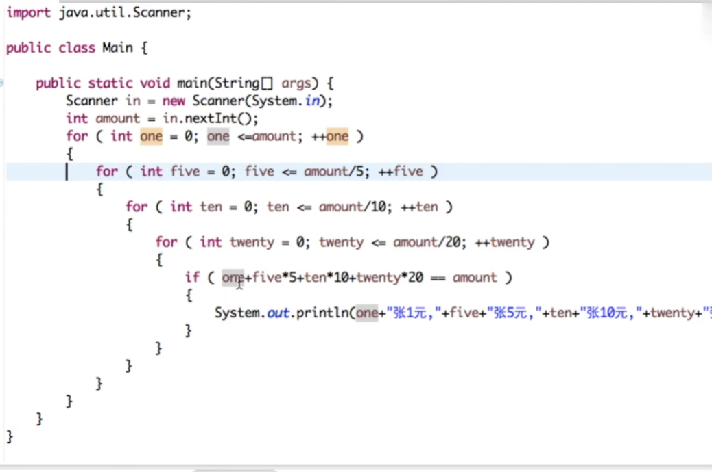
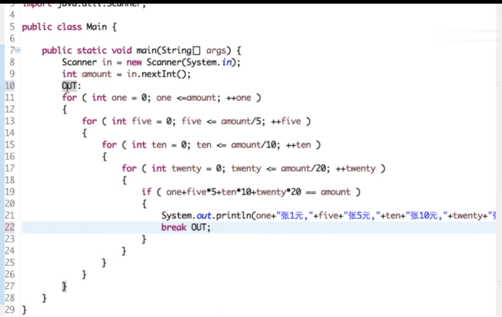
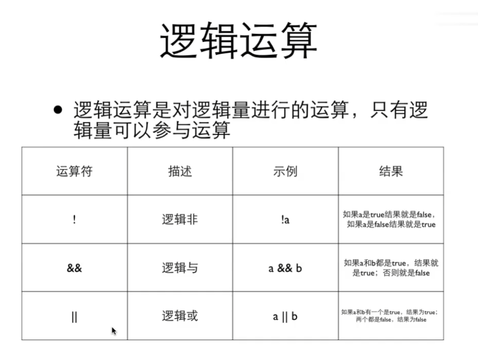
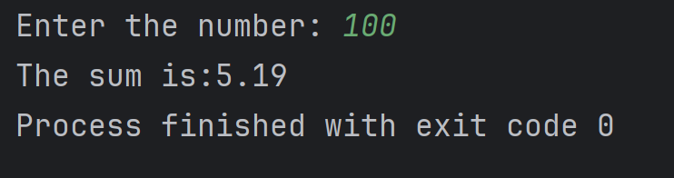
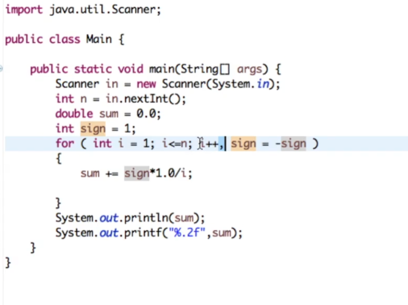

该笔记主要记录浙江大学翁恺的[java入门与进阶课程](https://www.bilibili.com/video/BV1wL411L7A3?p=3)的学习笔记，主要包括第4小节的循环的内容，包括for循环，复合赋值、循环控制、多重循环等相关知识
<!-- more -->

## 1 for 循环

很简单的可以用之前的while语句写出代码：

~~~java
import java.util.Scanner;

public class Factor {
    public static void main(String[] args) {
        Scanner in = new Scanner(System.in);
        System.out.print("Enter a number: ");
        int num=in.nextInt();
        int factor=1,i=1;
        while(i<=num){
            factor=factor*i;
            i++;
        }
        System.out.println("阶乘是："+factor);
    }
}

~~~

但输入20的阶乘之后其结果是负数：

这是因为对于int来说，一个int最大是4个bit，也就是最大是$2^{31}-1$。

类比的，我们可以用for循环实现：

~~~
import java.util.Scanner;

public class Factor {
    public static void main(String[] args) {
        Scanner in = new Scanner(System.in);
        System.out.print("Enter a number: ");
        int num=in.nextInt();
        int factor=1;
        for(int i=1;i<=num;i++){
            factor=factor*i;
        }
        System.out.println("factor is："+factor);
    }
}

~~~

这样可以把i定义在for循环内部，出了for循环之后就不用了，这很方便使得外面不会影响。同时，for循环看起来更加简洁一些，实际上for和while是可以接近的相互转换的

> 需要注意的是，for循环后面有分号的时候，会报错，这是因为和while一样，有分号导致for循环什么都不做，直接空循环。
>
> 所以建议，不管是for循环还是while循环，我们都还是很有必要加上大括号的

使用区别：如果有明确的使用次数时，用`for`，如果这个循环是必须先做一次再循环，那么就使用`do while`， 其他情况则可以使用`while`

## 2 复合赋值

~~~java
a=a+6 <==> a+=6
a=a*6 <==> a*=6
a*=b+6 <==>a= a*(b+6)
    
除此之外：
i=i+1 可以改写为 i++，实际上++i也表示i=i+1
~~~

需要注意的是，以下情况有所不同：

~~~java
对于 i=6
a=i++ 此时是先i赋值给a，然后再i++， 所以a=6，i=7
a=++i 此时是i先++ 再赋值给a，所以a=7，i=7
~~~

这种使用最好谨小慎微，建议只有i=i+1的时候单独使用，不要像上面一样和a=++i一样和其他的变量混合在一起

## 3 循环控制

task： 判断质数

对于6，我们在2里面就已经可以知道6可以被2整除了，我们没必要继续后面的循环了，所以需要跳出循环，这里就要使用`break`跳出循环：

~~~java
import java.util.Scanner;

public class JudgePrimeNumber {
    public static void main(String[] args) {
        Scanner in = new Scanner(System.in);
        System.out.print("Enter a number: ");
        int num = in.nextInt();
        if (num<2){
            System.out.println(num + " can not decide whether it is prime number or not");
        }
        else {
            for (int i = 2; i < num; i++) {
                if (num % i == 0) {
                    System.out.println(num + " is not a prime number.");
                    break;
                } else if (i == num - 1) {
                    System.out.println(num + " is a prime number.");
                }
            }
        }
    }
}

~~~

与`break`类似的是`continue`：

唯一的区别是，对于循环体，如果遇到`break`那么整个循环结束，而遇到`continue`则是该循环体位于`continue`后面的内容不执行，但是循环依然要继续跑

## 4 多重循环

**task: 输出100以内的素数**

那么相当于是在3的代码外面，还要进行一次循环以实现遍历

~~~
import java.util.Scanner;

public class JudgePrimeRange {
    public static void main(String[] args) {
        for (int j=2;j<=100;j++){
            if (j==2){
                System.out.print(j + " ");
            }
            for (int i = 2; i <j; i++) {
                if (j % i == 0) {
//                    System.out.println(j + " is not a prime number.");
                    break;
                } else if (i == j- 1) {
                    System.out.print(j + " ");
                }
            }
        }
    }
}

~~~

那么如何输出前50个素数呢，由于我们不知道第50个素数是多大，所以我们不适合用for循环，此时适合用while循环了

**task：凑硬币**

已知有1块钱，5块钱，10块钱，20块钱，怎么凑出33块钱，有什么方案，那么可以不停的嵌套循环：

需要注意的是，如果我们只要一种结果的话，`break`只能停止当前所在的这一个循环，有一个方法是，在最外面的循环上，加一个标号，例如我取名为`OUT`，那么在`break`的时候我们可以`break`整个标号的循环：

## 5 逻辑类型

对于我们需要判断是或者不是的时候，我们可以直接将变量定义为布尔类型：

~~~java
boolean isprime=true
~~~

这样在if的时候可以直接使用：

~~~java
if (isprime){
	operation
}
~~~

逻辑类型之间是存在逻辑运算的：

这应用于处理区间的问题：

对于$4<x<6$这种情况，java不能直接进行判断，这时我们可以`x<6&&x>4`来实现

布尔值的运算是有优先级的：**！>&&>||**

## 6 task: 求和

对于以下函数如何求解呢：
$$
f(n)=1+\frac{1}{2}+\frac{1}{3}+\cdots+\frac{1}{n}
$$

很容易写出以下代码
~~~Java
import java.util.Scanner;

public class GetSum {
    public static void main(String[] args) {
        Scanner in=new Scanner(System.in);
        System.out.print("Enter the number: ");
        int num= in.nextInt();
        double sum=0.0;
        for (int i=1;i<=num;i++){
            sum=sum+1.0/i;
        }
        System.out.printf("The sum is:%.2f ",sum);
    }
}

~~~

需要注意的是，保留若干位的时候，需要用`printf`，然后使用`%.nf `这里的`n`是保留位数

如果要更换成以下的形式呢：
$$
f(n)=1-\frac{1}{2}+\frac{1}{3}-\frac{1}{4}+\cdots+\frac{1}{n-1}-\frac{1}{n}
$$
for的第三个括号里的操作式是可以多项的：

也可以用乘方的形式：

~~~java
import java.util.Scanner;

public class GetSum2 {
    public static void main(String[] args) {
        Scanner in=new Scanner(System.in);
        System.out.print("Enter the number: ");
        int num= in.nextInt();
        double sum=0.0;
        for (int i=1;i<=num;i++){
            sum=sum+(Math.pow(-1.0,i+1))*(1.0/i);
        }
        System.out.printf("The sum is:%.2f ",sum);
    }
}

~~~

## 7 task：求解最大公约数

不难写出：

~~~java
import java.util.Scanner;

public class FineMaxCommonDivisor {
    public static void main(String[] args) {
        Scanner in = new Scanner(System.in);
        System.out.println("Enter two numbers: ");
        int a = in.nextInt(), b = in.nextInt();
        int common=1;
        for (int i=2; i<=Math.min(a,b);i++){
            if (a%i==0 && b%i==0){
                common=i;
            }
        }
        System.out.println("The common number is: "+common);
    }
}

~~~

上述的解决方法是一个计算次数比较多的方法，属于比较笨的方法，那么一个简单的方法是辗转相除法：

比如说 a=12，b=18

首先求解 r=a%b=12，此时令a=b=18，b=r=12

然后继续 r=a%b=18%12=6 那么此时a=12，b=6

继续来 r=a%b=12%6=0 那么此时a=6 b=0

这里的最后的a就是最大公约数，考虑到这个情况，我们不知道循环什么时候结束，所以应该使用`while`

使用上述的辗转相除法，我们可以迅速的写出代码：

~~~
import java.util.Scanner;

public class FineMaxCommonDivisorAdvance {
    public static void main(String[] args) {
        Scanner in = new Scanner(System.in);
        System.out.println("Enter two numbers: ");
        int a = in.nextInt(), b = in.nextInt();
        int r,oa=a,ob=b;
        while(b!=0){
            r=a%b;
            a=b;
            b=r;
        }
        System.out.println("The "+oa+" and"+ob+"'s max common divisor is: "+a);
    }
}

~~~

