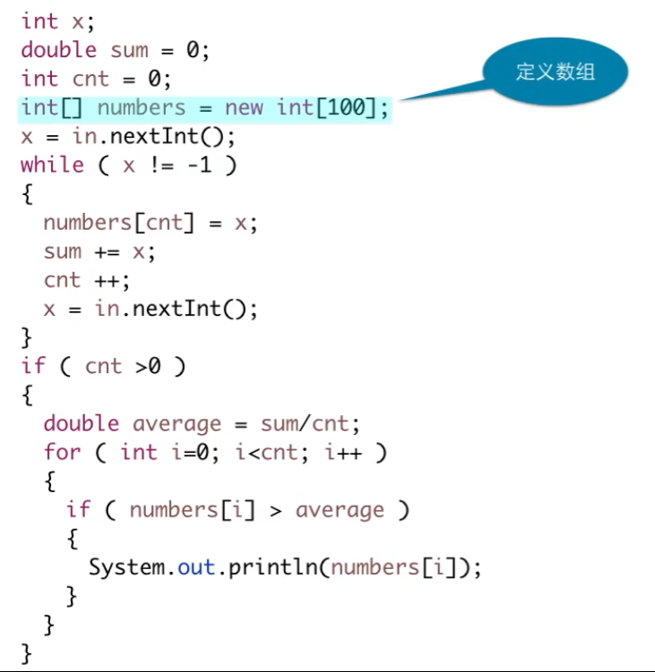
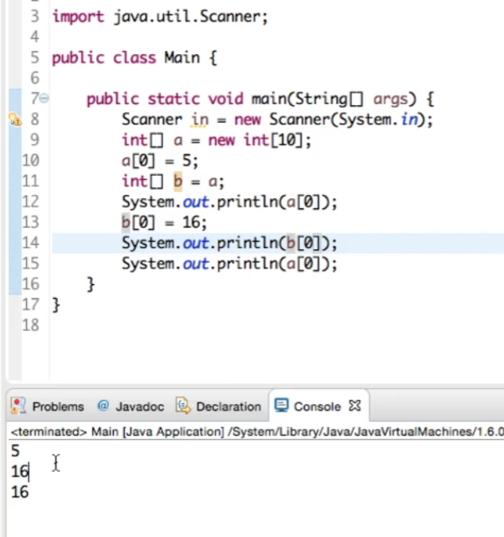
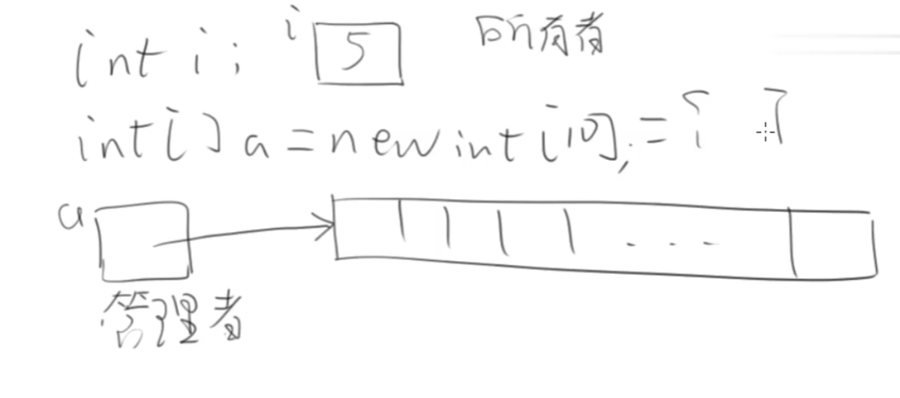
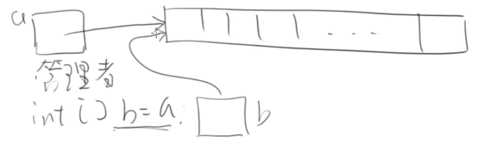
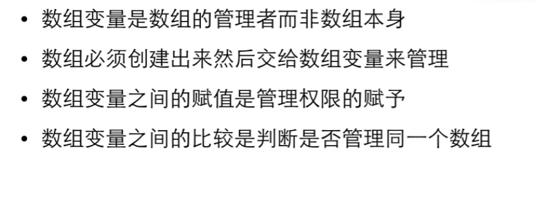
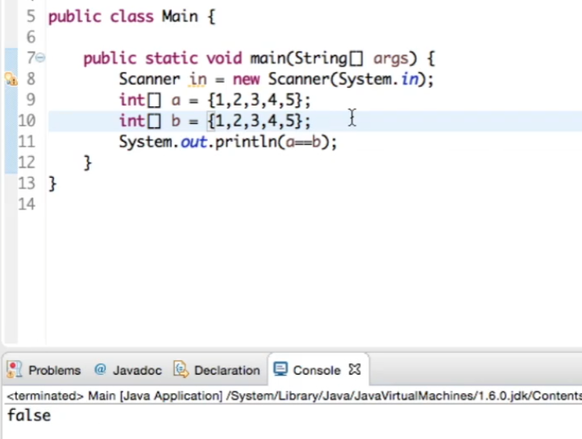
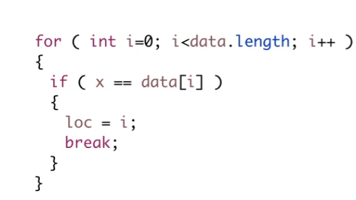
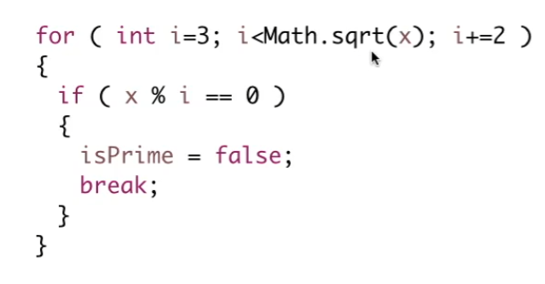
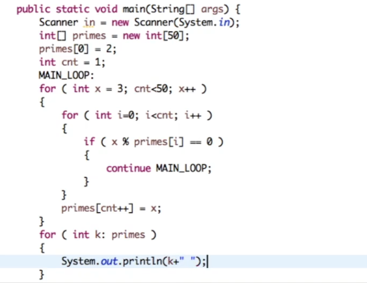

该笔记主要记录浙江大学翁恺的[java入门与进阶课程](https://www.bilibili.com/video/BV1wL411L7A3?p=3)的学习笔记，主要包括第5小节的数组相关的内容，包括数组的创建，数组内的元素，数组变量等相关知识
<!-- more -->

## 1 初识数组

对于有些应用场景，比如说我们需要计算平均数的同时还需要给出大于平均数的数字有哪些，这时候我们输入的数字需要被记录了，这时候设定很多的变量往往是不太合适的（笨办法），如何应对这个情况这就是数组的产生。

~~~java
int[] numbers =new int[100]
~~~

创建一个名为`numbers`的能够容纳100个`int`的数组

具体而言，往里面填入数字：

~~~
numbers[index]=values_index
~~~

例如：

## 2 创建数组

数组是一种容器，其特点是一旦创建，不能改变大小；其中所有元素的类型是一样的

例如对于1  中的`numbers`数组：

~~~java
int[] numbers =new int[100]
~~~

创建之后，就只能存入int，且只能存100个

创建的格式如下所

~~~java
<类型>[]<数组名称>=new <数组内元素的类型>[数组的元素个数]
~~~

需要注意的是，数组的索引是从0开始的

## 3 数组的元素

访问数组的元素是用索引实现，如我们想调出数组`numbers`的第五个元素：

~~~java
numbers[4]
~~~

对其赋值也行：

~~~java
numbers[4]=11
~~~

需要注意的是，即便你的索引超过了数组的索引边界，在写代码的时候编译器是不会检查出是否有效的，只有在运行的时候你才知道你的索引超过了索引边界

因此，在未知用户输入的数字数目的时候就设定数组的数量是危险的，我们应该根据用户读进来的数字的数量来设定数组的大小，这样就避免了溢出索引的问题

数组有一个固有的属性，也就是length：

~~~java
for (int i=0;i<grade.length;i++){
	operation
}
~~~

这里的`grade`是数组

## 4 数组变量

除了先初始化后逐个赋值（new的方式）以外，也可以直接在初始化的时候就进行赋值：

~~~java
int[] scores={97,87,97,88,67,22}
~~~

需要注意的是这是因为普通变量就对应着变量的数值，但是对于数组来说，数组和数据只是一个指针指引：

所以当`int[]b=a`的时候，相当于b也建立了和a指向同一个位置的索引：

那么通过b索引改变数据的第0个位置，那么a索引下同样也会发生改变

总结：

如果是两个不同的索引，索引的地址也不一样，即便索引的数组的内容是一样的，但两者也是不同的：

所以判断两个数组的内容是否相等也不能直接用上述`==`来判断，而是要经过循环之后逐个元素的比较来判断是否是相等的数组

## 5 task：投票统计

~~~java
import java.util.Scanner;

public class VoteStatistic {
    public static void main(String[] args) {
        Scanner in = new Scanner(System.in);
        int x;
        int[] numbers =new int[10];
        x=in.nextInt();
        while(x!=-1){
            if(x>=0 && x<=9){
                numbers[x]++;
            }
            x=in.nextInt();
        }
        for(int i=0;i< numbers.length;i++){
            System.out.println(i+" : "+numbers[i]);
        }
    }
}

~~~

直接创建输入[0,9]出现次数的数组

## 6 遍历数组

一般都使用从0开始遍历到length的for循环来遍历

除此之外还可以：

~~~java
for (int k:data){
	operation
}
~~~

这就是for-each循环，每次循环的k是data内的内容，特别适合遍历数组里的每一个内容，但是不足之处是他并不知道k的索引位置。需要注意的是，这里如果是：

~~~java
for (int k:data){
	k=9;
}
~~~

这里并不能改变数组的内容

## 7 task：素数

之前的算法是从2开始遍历到n-1，要计算n-2次循环

只需要计算到平方根就行：

还有一个方法就是利用素数表

相当于是，下一个素数是否是素数，只需要判断其能不能被素数表里的素数整除

另外，也还有其他的方法：

~~~java
boolean[] isprime = new boolean[100];
for (int i=0;i<isprime.length;i++){
	isprime[i]=true;
}
for (int i=2; i<isprime.length;i++){
	if (isprime[i]){
		for (int k=2;i*k<isprime.length;k++){
			isprime[i*k]=false;
		}
	}
}
for (int i=2;i<isprime.length;i++){
    if (isprime[i]){
        System.out.println(i);
    }
}
~~~

也就是素数的倍数都不是素数，剩下的都是素数了

## 8 二维数组

~~~java
int [][] a = new [3][5];
~~~

构造了一个3行5列的矩阵like的数组

二维数组的初始化也可以向一维数组一样：

~~~java
int [][] a={
	{1,2,3,4},
	{1,2,4},
};
~~~

构造了一个2行4列的数组，其中不够的会自动补零

三行棋写了一个比较复杂的代码：
~~~java
import java.util.Scanner;

public class board {
    public static void main(String[] args) {
        Scanner in = new Scanner(System.in);
        final  int Size=3;
        int [][] board= new int[Size][Size];
        for (int i=0;i<Size;i++){
            for (int j=0;j<Size;j++){
                System.out.print("Enter the value of board line"+(i+1)+"  and column"+(j+1)+":");
                board[i][j]=in.nextInt();
            }
        }
        MainLOOP:
        for (int i=0;i<Size;i++){
            int const_num=board[i][0];
            for (int j=0;j<Size;j++){
                if (board[i][j]!=const_num){
                    break;
                }
                else if (board[i][j]==const_num && j==Size-1){
                    System.out.print(const_num+" wins ");
                    break MainLOOP;
                }
            }
        }
        MainLOOP2:
        for (int j=0;j<Size;j++){
            int const_num=board[0][j];
            for (int i=0;i<Size;i++){
                if (board[i][j]!=const_num){
                    break;
                }
                else if (board[i][j]==const_num && i==Size-1){
                    System.out.print(const_num+" wins ");
                    break MainLOOP2;
                }
            }
        }
        int const_num=board[0][0];
        for (int i=0;i<Size;i++){
            if (board[i][i]!=const_num){
                break;
            }
            else if (board[i][i]==const_num && i==Size-1){
                System.out.print(const_num+" wins ");
                break;
            }
        }
        const_num=board[0][Size-1];
        for (int i=0;i<Size;i++){
            if (board[i][Size-1-i]!=const_num){
                break;
            }
            else if (board[i][Size-1-i]==const_num && i==Size-1){
                System.out.print(const_num+" wins ");
                break;
            }
        }
    }
}

~~~

