该笔记主要记录浙江大学翁恺的[java入门与进阶课程](https://www.bilibili.com/video/BV1wL411L7A3?p=3)的学习笔记，主要包括第6小节的字符相关的内容，包括字符类型，逃逸字符，包裹类型等相关知识
<!-- more -->

## 1 字符类型
单个字符是一种特殊的类型：char
~~~java
char c='a';
char d='汉';
~~~

单个汉字也是一个字符

对于字符进行++ 会得到排在unicode表后的文字，对于字符做加减法运算之后得到的就是数而不是字符了

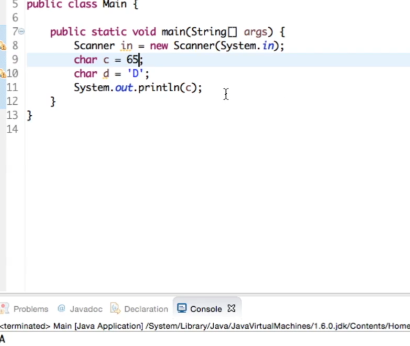

也可以给出Unicode的编号，程序也能给出对应的字母

## 2 逃逸字符

反斜杠开头加上另一个字符表示的一些操作：

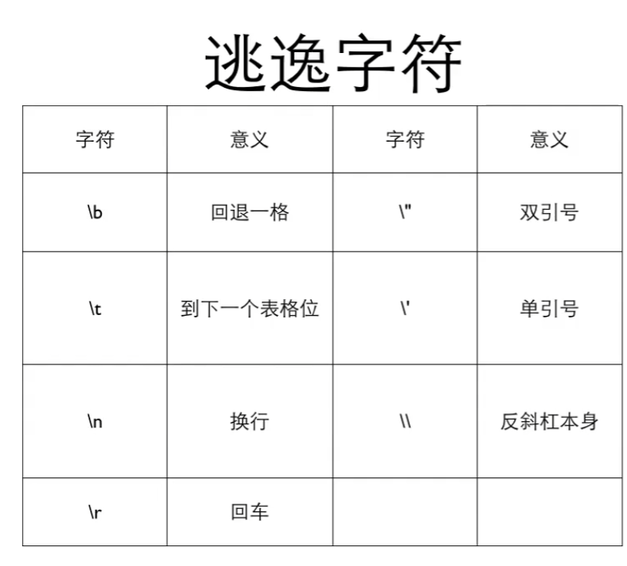

其中`\b`的效果如图所示：

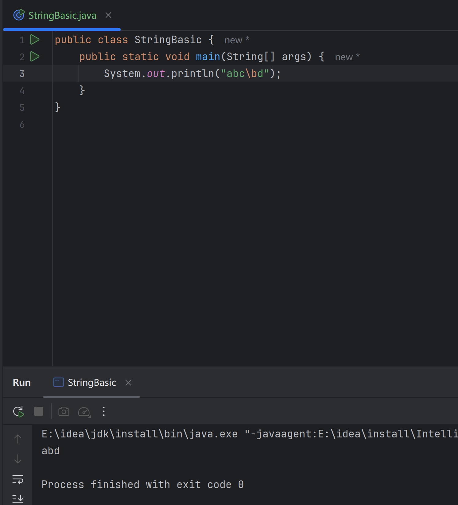

而`\t`在是到下一个制表，类似于表格行对齐一样（只能在一个tab内）：

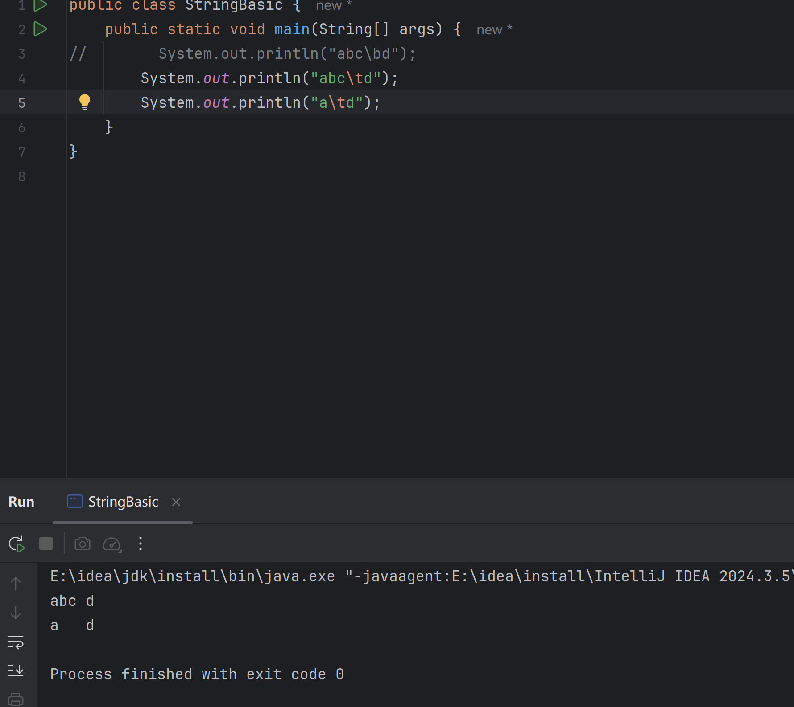

## 3 包裹类型

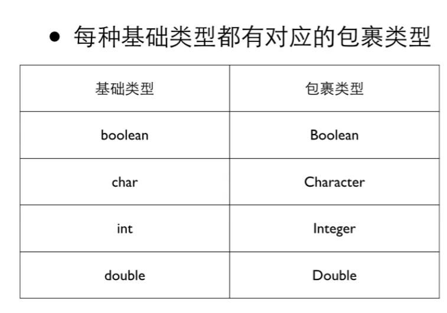

包裹类型和基础类型一样，都是可以用于定义变量。它可以做基础类型的事情的同时，还可以做一些包裹类型独特的功能：

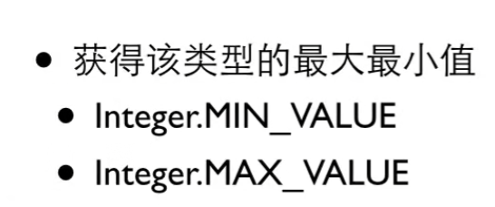

这里面的`.`就是一个运算符，用于让一个类或者一个对象做什么事情

还有转换大小写的：

~~~java
System.out.println(Character.tolowerCase('I'));
~~~

以及判断大小写的

~~~java
System.out.println(Character.islowerCase('I'));
~~~

## 4 字符串变量

双引号括起来的里面的内容一般是字符串，用于字符串的变量是`String`，需要注意的是其是包裹类型，字符串变量是字符串的管理者而不是所有者，创建字符串的变量也得用`new`来创建

~~~java
String s = new String ("a string");
~~~

也可以直接初始化：

~~~java
String s="hello string";
~~~

字符串的链接可以用`+`实现链接，如果`+`的另一边不是字符串，java会自动把不是字符串的内容转化成字符串

~~~java
String s="hello";
System.out.println(s+20+25)
~~~

得到的是hello2025而不是hello45

对于输入而言，也有一些差别：

~~~java
s=in.next();
输入 this is an apple
s只有this

s=in.nextln();则可以读取整行的内容
~~~

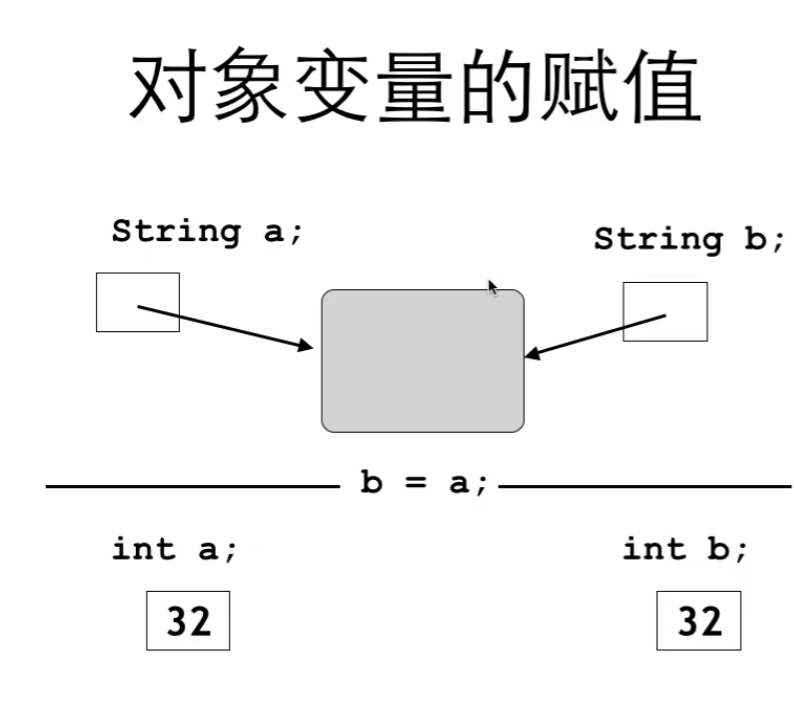

所以比较两个字符串的内容是不是一样的话，需要用`.equals` 方法

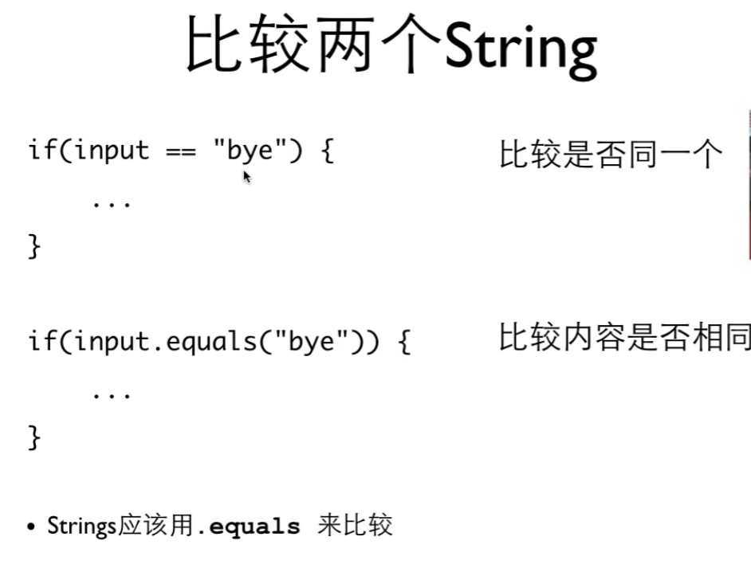

## 5 字符串操作

字符串比大小：

~~~java
s1.compareTo(s2);
"abcd".compareTo(s2);
~~~

比较s1和s2两个字符串变量的字符串内容谁大

计算字符串的长度用length，需要注意的是`length()`是右括号的

~~~
String s="hello";
s.length()是5
~~~

遍历字符串可以用：

~~~
for (int i=0; i<s1.length();i++){
	System.out.println(s1.charAt(i));
}
~~~

其中`s1`是一个字符串变量

截断字符串则可以使用`substring`,范围是左闭右开:

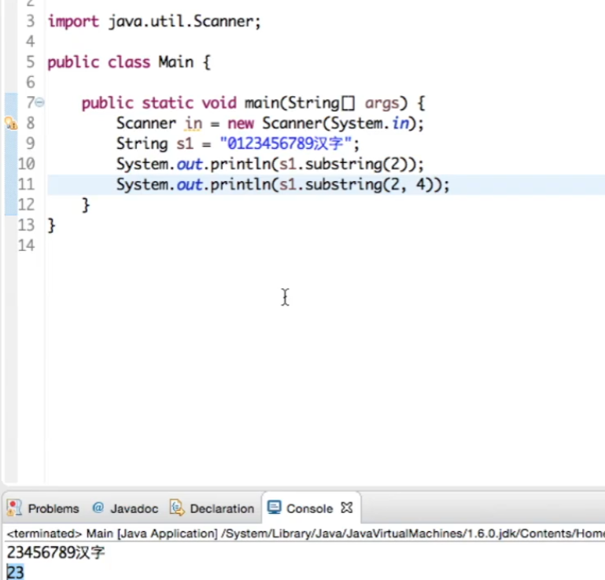

除此之外还有一些有意思的操作：

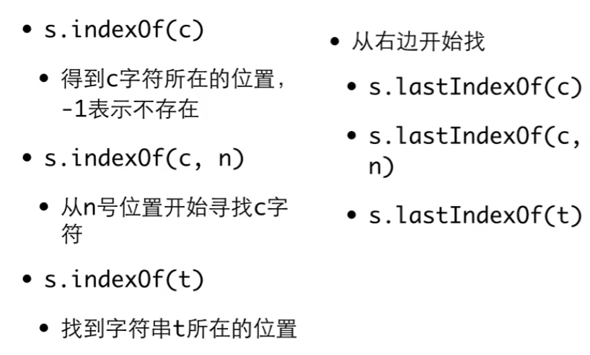

找出现多次的某个字符：

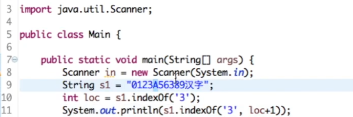

通过一个loc的方式来实现

需要注意的是，刚刚的这些所有操作都不会改变原先的字符串，而是制造了一个新的字符串

当然，`switch case`也可以用字符串实现

## 6 Math 类

一些常见的方式：`abs`，`pow`（pow（2，3）=$2^3$），`random`（产生（0，1）之间的随机数），`round`(四舍五入)

这些操作也就是函数
