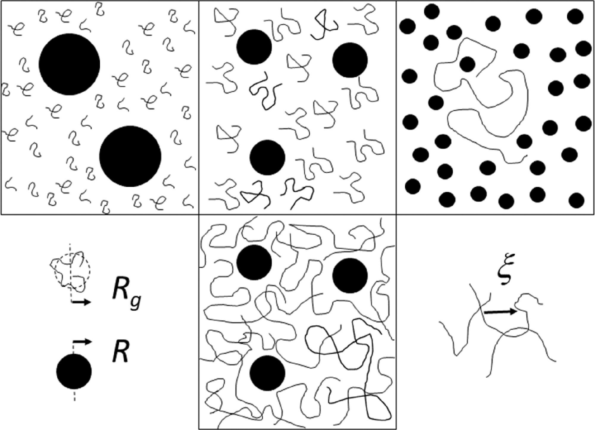
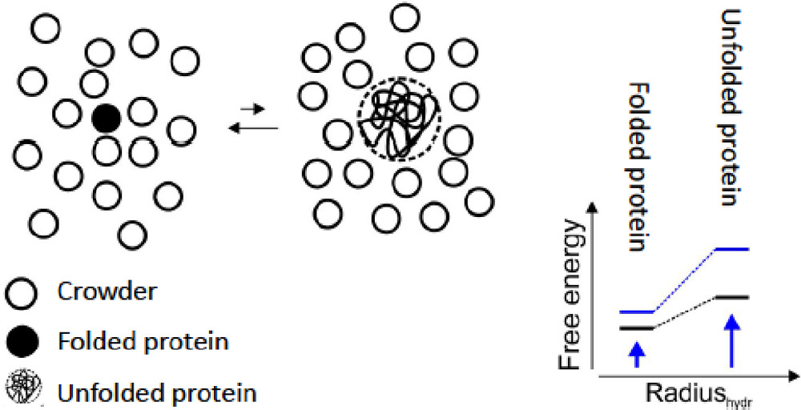
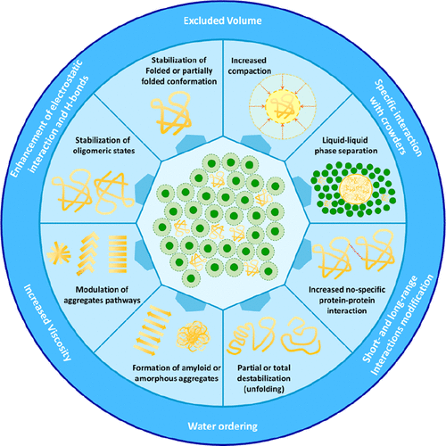
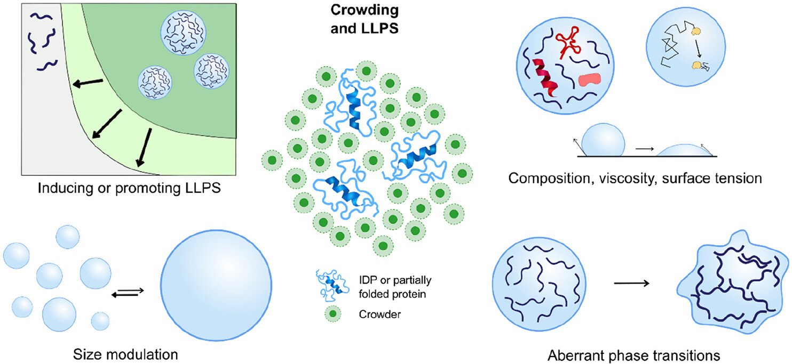
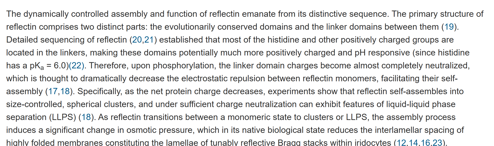
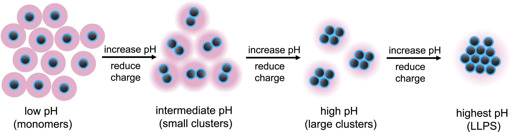
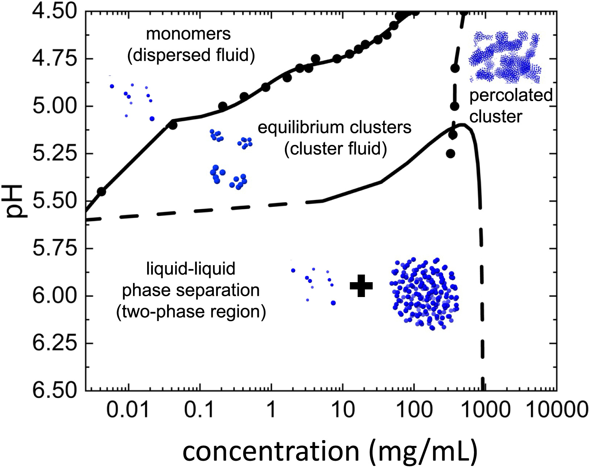
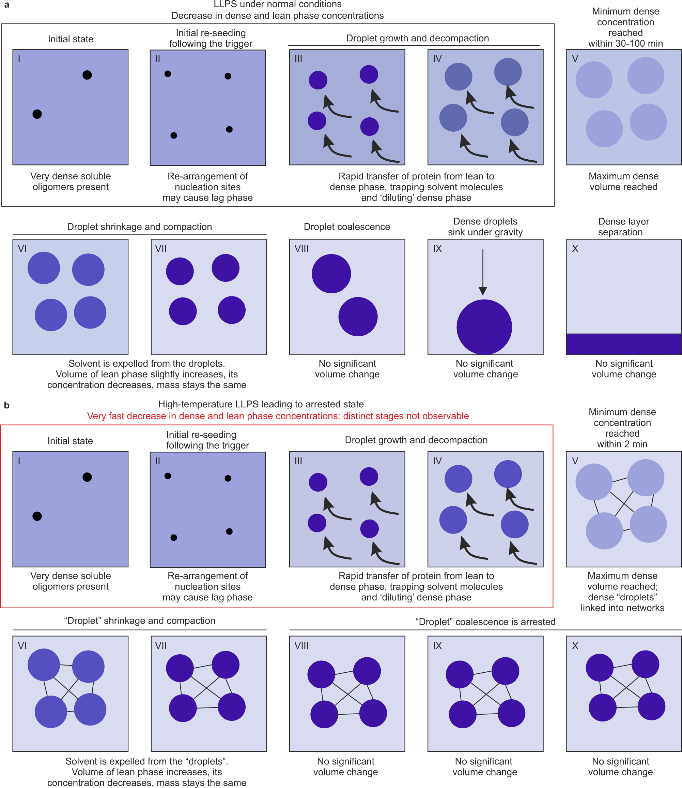

该笔记主要记录液液相分离的调控机制相关内容，包括crowding的相关理论，NMR表征相分离过程以及BSA相分离过程解析，以及残基相互作用机制
<!-- more -->

## 1 Molecular Crowding: The History and Development of a Scientific Paradigm

reference：Alfano C, Fichou Y, Huber K, et al. Molecular crowding: the history and development of a scientific paradigm[J]. Chemical Reviews, 2024, 124(6): 3186-3219.

相分离中两相的crowding 判断往往与R以及回转半径Rg相关：

1. **左上：Colloid Limit (Rg < R)**
   - **大黑球是胶体（colloid）颗粒**，小弯曲线是高分子链。
   - 因为**Rg < R**，即高分子链的尺寸比胶体小，**胶体成为被crowding的对象**，而高分子是**crowder（拥挤者）**。
   - 这就是你提到的：**macromolecules as crowder**。
2. **中上：Rg ∼ R**
   - 高分子链与胶体大小差不多，二者相互作用对空间的竞争变得重要。
   - 在这个比例下，crowding更复杂，不能简单区分谁是crowder。
3. **右上：Protein Limit (Rg > R)**
   - 高分子链很大，胶体变成小点（类似蛋白质粒子）。
   - 胶体（例如蛋白质）成了**crowder**，而高分子链是受限的对象。

相关长度 ξ（correlation length）描述crowding的微观尺度特征

 Wang et al. [(61)](javascript:void(0);) stated that crowding can affect protein stability in two ways: by hard-core repulsions or by soft chemical interactions. ——crowding可以通过两种方式影响蛋白质稳定性：通过硬核排斥或软化学相互作用

> Wang, Yaqiang; Sarkar, Mohona; Smith, Austin E.; Krois, Alexander S.; Pielak, Gary J.
>
> Journal of the American Chemical Society (2012), 134 (40), 16614-16618CODEN: JACSAT; ISSN:0002-7863. (American Chemical Society)

The explicit contraposition of entropy and enthalpy in the effect of crowders on protein stability was accepted also by other authors. For example, Senske et al., [(63)](javascript:void(0);) when studying the thermal unfolding of ubiquitin, observed that addition of other solutes (glucose, dextran, PEG, guanidinium, and urea) led to both enthalpic and entropic destabilization. The authors argued that the classification of cosolute effects based on their excess enthalpic contributions results in a comprehensive thermodynamic model.其他作者也接受了熵和焓对人群稳定性的影响。例如，Senske等人（63）在研究泛素的热展开时，观察到添加其他溶质（葡萄糖、葡聚糖、聚乙二醇、胍和尿素）导致了焓和熵不稳定。作者认为，基于其过剩焓贡献的宇宙效应的分类导致了全面的热力学模型。

> BSA LLPS加尿素之后，LLPS难以形成的原因？

对于crowding的看法，有一种观点认为其就该是惰性的，不与研究目标分子产生相互作用的，所以选取的一般是PEG，DEXTRAN，FICOLL和POLY（4-苯甲酸钠）（PSS）。这些聚合物通常以多分散物种的形式提供，因此具有分子质量的分布——熵焓分离，主要是熵效应主导？

另一种看法是，crowding实际上是会和目标分子有较弱的相互作用的，如Lee 等人研究了PEG与蛋白特定碱基的相互作用——起到还有焓效应的影响

>  Lee, Cheng-Chung; Su, Yu-Cheng; Ko, Tzu-Ping; Lin, Li-Ling; Yang, Chih-Ya; Chang, Stanley Shi-Chung; Roffler, Steve R.; Wang, Andrew H.-J. Journal of Biomedical Science (London, United Kingdom) (2020), 27 (1), 12CODEN: JBCIEA; ISSN:1423-0127. (BioMed Central Ltd.)

一些研究者选取的经典的LLPS蛋白体系：Examples of these proteins are the bovine pancreatic trypsin inhibitor (BPTI), ribonuclease A, lysozyme, β-lactoglobulin, hemoglobin, and bovine serum albumin (BSA)

蛋白的紧密折叠会减少其与周围crowder的空间斥力，进而降低自由能

氢键结构也会影响热力学稳定性——淀粉样蛋白

小液滴通过聚集和熟化逐渐形成较大的液滴

可以参考这个图画图

## 2 A colloidal model for the equilibrium assembly and liquid-liquid phase separation of the reflectin A1 protein

reference: Huang T C, Levenson R, Li Y, et al. A colloidal model for the equilibrium assembly and liquid-liquid phase separation of the reflectin A1 protein[J]. Biophysical Journal, 2024, 123(18): 3065-3079.

A1 蛋白由`evolutionarily conserved domains` 和 `linker domains between them`组成。linker主要响应pH等电性变化，conserved 区域则可能存在非特异性的疏水相互作用

高度折叠的蛋白，如溶菌酶，GG，等可以使用SA-LR模型进行描述

对于pH和浓度对相分离的影响，应该不少的蛋白都能够画出相图：

## 3 Temporal and spatial characterisation of protein liquid-liquid phase separation using NMR spectroscopy

reference： Bramham J E, Golovanov A P. Temporal and spatial characterisation of protein liquid-liquid phase separation using NMR spectroscopy[J]. Nature Communications, 2022, 13(1): 1767.

使用三氟乙醇TFE作为NMR的探针来研究BSA相分离体系

背景reference：

> During liquid-liquid phase separation (LLPS), a homogenous mixture of macromolecules separates into two distinct liquid phases, a ‘dense’ condensed phase enriched with a subset of components, and a ‘lean’ phase depleted of these components. This process is increasingly recognised in biology[1](https://www.nature.com/articles/s41467-022-29408-z#ref-CR1),[2](https://www.nature.com/articles/s41467-022-29408-z#ref-CR2), where it is responsible for the formation of membraneless organelles and condensates, including the nucleolus[3](https://www.nature.com/articles/s41467-022-29408-z#ref-CR3) and stress granules[4](https://www.nature.com/articles/s41467-022-29408-z#ref-CR4), but also implicated in a range of diseases, including neurodegenerative diseases[5](https://www.nature.com/articles/s41467-022-29408-z#ref-CR5),[6](https://www.nature.com/articles/s41467-022-29408-z#ref-CR6),[7](https://www.nature.com/articles/s41467-022-29408-z#ref-CR7), cataracts[8](https://www.nature.com/articles/s41467-022-29408-z#ref-CR8),[9](https://www.nature.com/articles/s41467-022-29408-z#ref-CR9), and sickle cell anaemia[10](https://www.nature.com/articles/s41467-022-29408-z#ref-CR10). LLPS is also an important phenomenon in biotechnology, as a purification and processing technique[11](https://www.nature.com/articles/s41467-022-29408-z#ref-CR11),[12](https://www.nature.com/articles/s41467-022-29408-z#ref-CR12), or as an unwanted physical instability in biopharmaceuticals[13](https://www.nature.com/articles/s41467-022-29408-z#ref-CR13).在液 - 液相分离（LLP）期间，大分子的同质混合物分为两个不同的液相，一个富含一部分成分的“致密”凝结相，而这些成分耗尽的“瘦”相。该过程在生物学1,2中越来越多地认识到，在该过程中，它负责形成无膜细胞器和冷凝物，包括Nucleolus3和应激颗粒4，但也涉及一系列疾病，包括神经退行性疾病，包括神经退行性疾病5,6,7，5,6,7，Cataracts8,9，CatarArcts8,9，和镰状细胞Anaeemia10。 LLP在生物技术中也是一种重要现象，作为一种纯化和处理技术11,12，或者是生物药物中有害的身体不稳定13。
>
> LLPS, sometimes referred to as condensation, manifests itself as the appearance of small dense liquid droplets suspended within a lean phase (microscopic LLPS), which often proceeds to the formation of distinct dense and lean layers in the sample once the droplets become large enough and coalesce (macroscopic LLPS). As the dense and lean phases exist in both scenarios, it is convenient to use the term “layer separation” to refer to this final stage of macroscopic LLPS. The kinetics of these processes, and the effect of different conditions or additives on these kinetics, is of particular interest[14](https://www.nature.com/articles/s41467-022-29408-z#ref-CR14),[15](https://www.nature.com/articles/s41467-022-29408-z#ref-CR15). However, these processes are difficult to study by existing techniques. Light scattering due to the presence of liquid droplets, or fluctuations in density or refractive index often results in opalescent or turbid solutions, rendering quantitative optical approaches challenging[16](https://www.nature.com/articles/s41467-022-29408-z#ref-CR16),[17](https://www.nature.com/articles/s41467-022-29408-z#ref-CR17). Fluorescence microscopy using labelled LLPS components or dyes may report on the radius of droplets, but not the concentration of the two phases[15](https://www.nature.com/articles/s41467-022-29408-z#ref-CR15),[18](https://www.nature.com/articles/s41467-022-29408-z#ref-CR18). Additionally, layer separation adds a complicating spatial component, due to non-uniform distribution of the phases throughout the sample[19](https://www.nature.com/articles/s41467-022-29408-z#ref-CR19). Therefore, the physical and geometrical constraints of biophysical techniques mean each may be limited to studying one aspect of LLPS, and further characterisation techniques are needed to reach a more holistic assessment, particularly regarding the evolution of the concentration and volumes of the two phases.LLP有时被称为凝结，表现为悬浮在瘦相（微观LLP）内的小密集液滴的外观，一旦液滴变得足够大并结合（Macroscopic LLP），通常会在样品中形成不同的密集和瘦的层。由于在两种情况下都存在致密和精益阶段，因此使用术语“图层分离”来引用宏观LLP的最后阶段很方便。这些过程的动力学以及不同条件或添加剂对这些动力学的影响特别感兴趣14,15。但是，这些过程很难通过现有技术研究。由于存在液滴或密度或折射率的波动而引起的光散射通常会导致乳白色或浑浊的溶液，从而使定量光学方法提起质疑16,17。使用标记的LLP成分或染料的荧光显微镜可以报告液滴的半径，但不能报告两个相15,18的浓度。此外，由于整个样品中这些相的分布不均匀，因此层分离增加了复杂的空间成分。因此，生物物理技术的物理和几何约束意味着每种可能仅限于研究LLP的一个方面，需要进一步的表征技术来进行更全面的评估，尤其是关于这两个阶段的浓度和体积的演变。

