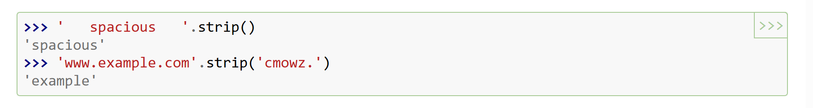
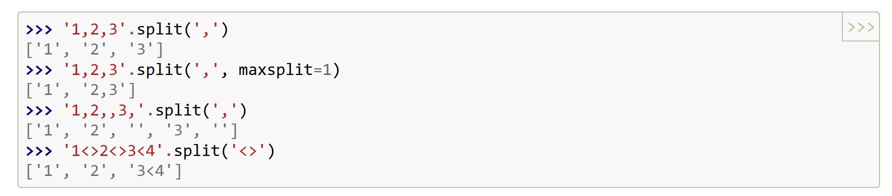

该笔记主要记录Harford的[CS50](https://cs50.harvard.edu/python/2022/)课程笔记，本笔记是对`str`相关用法，lecture3和lecture4的相关课程做的整理，包括`try`语句，以及`random`，`statistic`等package
<!-- more -->

## 1 str 常见用法

对字符串进行的常见操作有很多，比如大小写转化，分割，以及去除空格和输出格式化。具体的说明文档可以参考[here](https://docs.python.org/3/library/stdtypes.html#string-methods)

### 1.1 大小写转化

将字符串中所有的字母小写：

~~~python
str.lower()
~~~

判断是否是小写：

~~~python
str.islower
~~~

标题化（每个词的首字母大写。例如： I Like My Home)

~~~python
str.title()
~~~

判断是否是标题化的：

~~~python
str.istitle()
~~~

句子首字母大写：

~~~python
str.capitalize()
~~~

判断句子首字母是不是大写：

~~~python
str.iscapitalize()
~~~

将字符串的字母全部大写：

~~~python
str.upper()
~~~

同理判断是否是全大写：

~~~python
str.isupper
~~~

### 1.2 以xx开头，以xx结尾

~~~python
str.startswith(symbol_str)
~~~

这里的symbol_str是你要判断的开头的类型，如想知道是不是以`hello`开头那么可以用`str.startswith("hello")`

结尾同理：

~~~python
str.endswith(symbol_str)
~~~

### 1.3 去除内容

去除空格

~~~python
str.strip()
~~~

去除指定字符串：

### 1.4 分割与替换

#### 1.4.1 分割语句`split`

需要将字符串分割可以使用`split`语法，返回的是一个分割结果的列表，`maxsplit`参数控制`split`几次:

~~~python
str.split(sep,maxsplit)
~~~

如果sep什么都不填，默认按照空格` ` 进行分割

当然，假如我们知道一个字符串就是yyyy/mm/dd的形式，且我们只需要分割出年份，那么可以：

~~~python
str_date=2020/2/12
year,others_str = str_date.split("/",maxsplit=1)
~~~

不需要再从分隔列表进行赋值操作，直接将分割的结果存入变量：`year`是2020，`others_str`是2/12

#### 1.4.2 替换语句

~~~python
str.replace(old, new, count=-1)
~~~

这里的old是要被替换的字符串，而new是用来替换的那部分的字符串，替换次数由count控制：

~~~python
str_hello='hello'
str_hello=str_hello.replace("l","",1)
~~~

将`hello`里面的`l`替换成空，只替换一次，那么经过上述的操作之后`str_hello`变成`helo`

### 1.5 判断字符串是不是数字

由于有时我们输入比如说月份，有可能是June这种字母，也可能是数字6，所以为了提取信息我们需要判断是不是数字

~~~python
str.isdigit()
~~~

`isdigit`函数可以实现上述要去

~~~python
month='June'
if not month.isdigit():
	month=6
~~~

需要注意的是`  9` 这种在`isdigit()`里面是会判断非数字的，所以判断前最好`strip`空格 

## 2 字典按键的字母顺序排序输出值

由于我们往字典里添加键值对往往是无须的，那么为了排序输出，我们可以用以下的方式

~~~python
dict={
"banana":3,
"apple":2
}
for i in sorted(dict.keys()):
	print(dict[i])
~~~

用sorted函数实现

## 3 try 语句

~~~python
try:
	#something we try to do
except ValueError:
	# if ValueError occurs, what we need to do
else:
	# if no error occurs, what we need to do
~~~

我们可以使用break来打破循环while，也可以使用pass使得无事发生继续进行

## 
