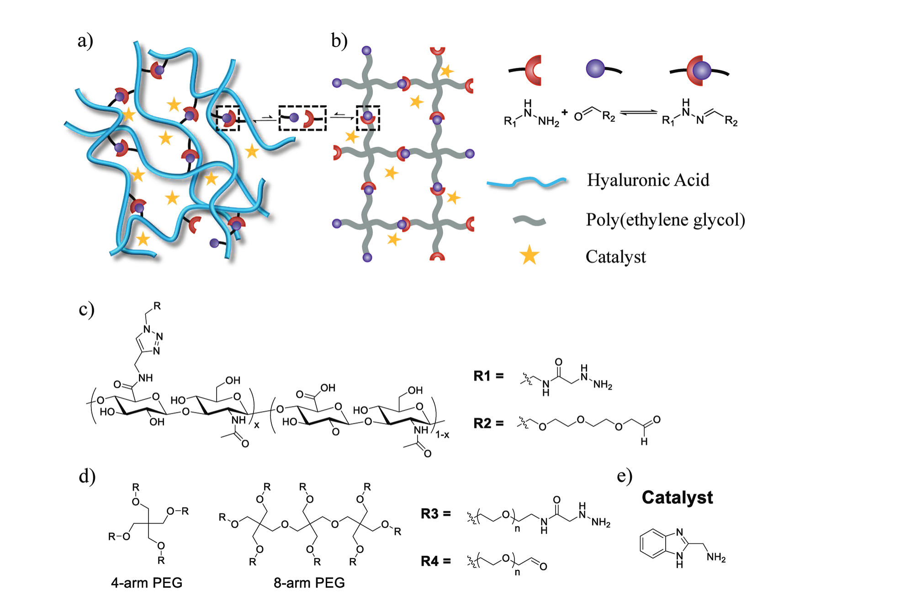
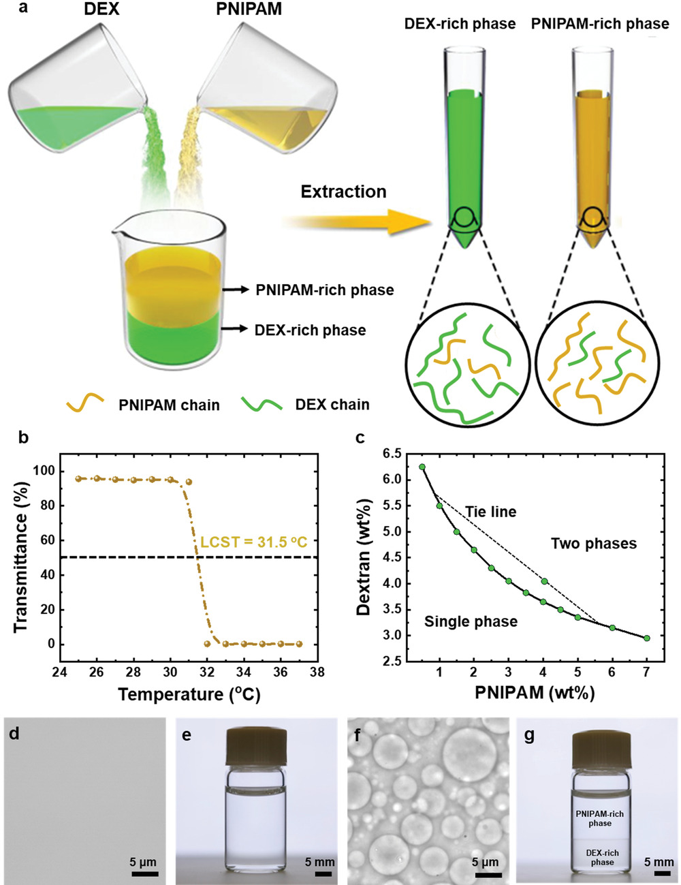
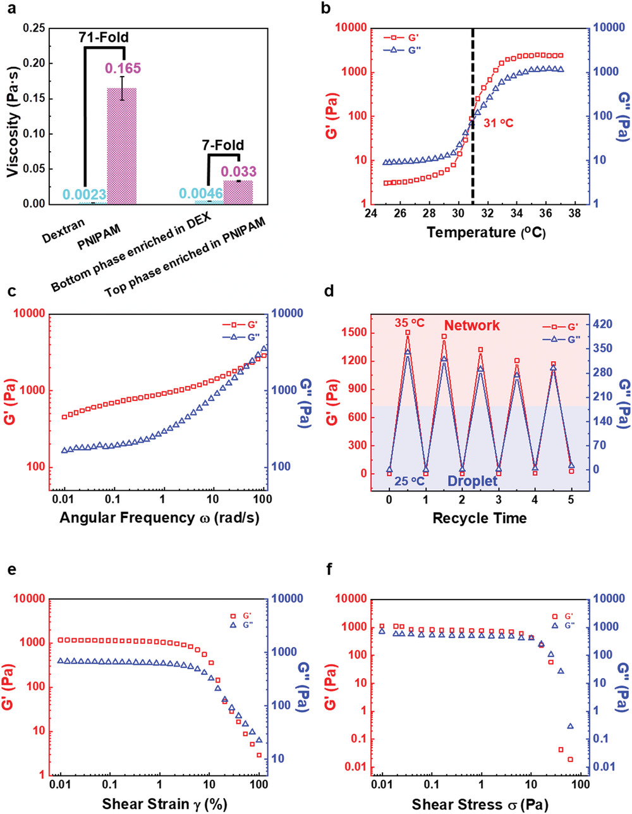
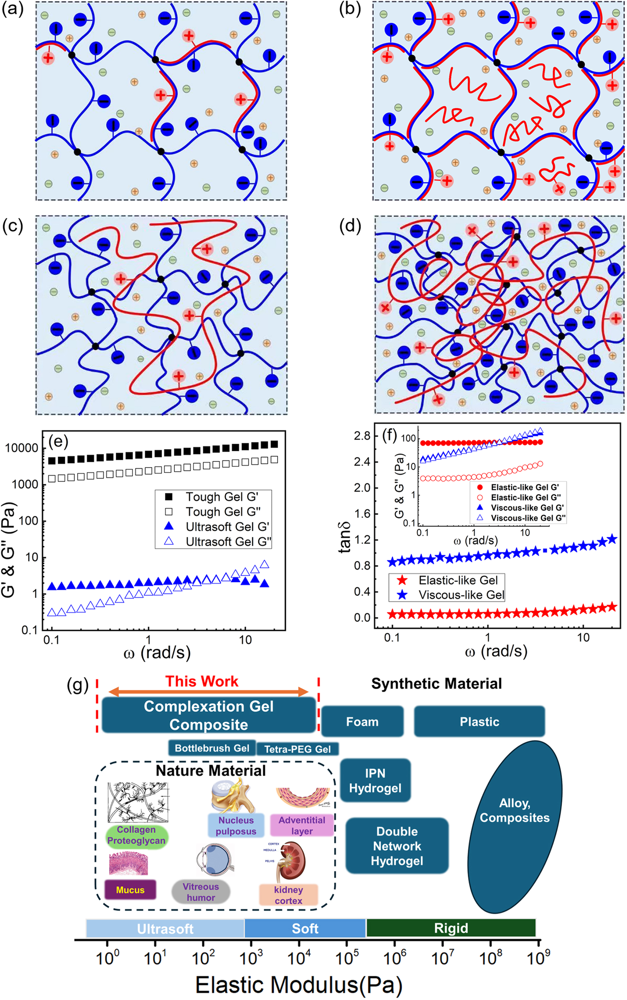
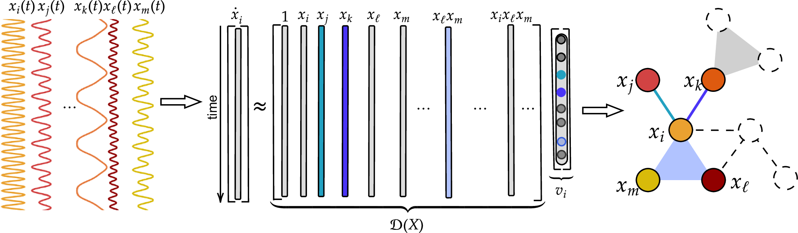
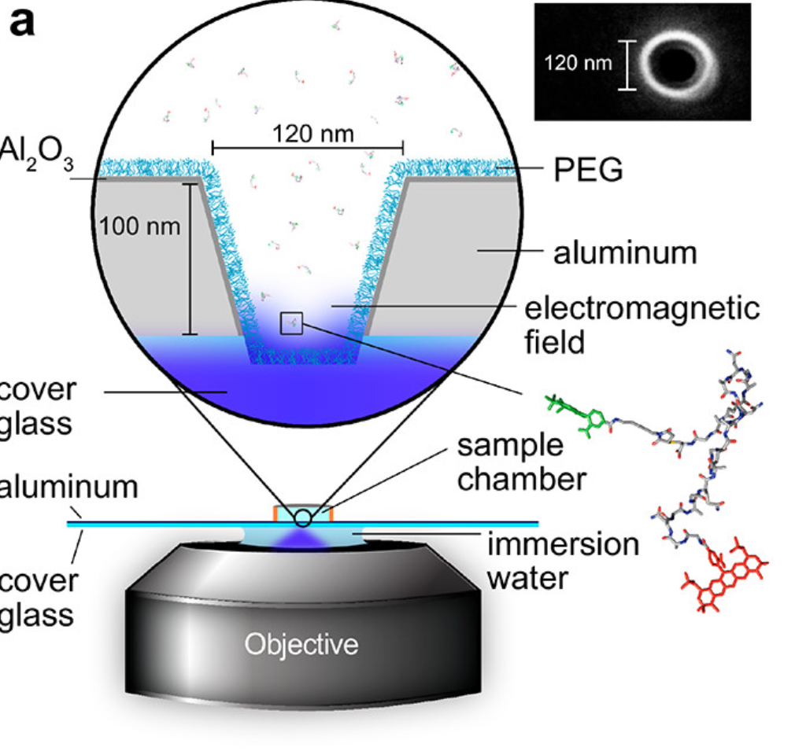
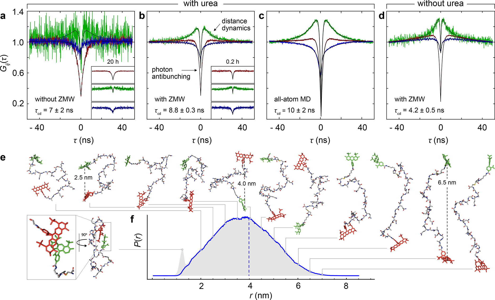

本笔记主要整理4.25部分的文献，包括粗读与精读的文献两个部分

<!-- more -->

## 1 Index

文献日读笔记2025.4.25更新情况：

| week  | Mon. | Tue. | Wed. | Thu. |   Fri.   | Sat. | Sun. |
| :---: | :--: | :--: | :--: | :--: | :------: | :--: | :--: |
| week1 |      |      |      |      | 20250425 |      |      |

## 2 Surfing Paper

一种可逆的水凝胶网络，加入催化剂促进水凝胶网络的转变

> J. Lou, S. Friedowitz, K. Will, J. Qin, Y. Xia, *Advanced Materials*. **33**, 2104460 (2021).

一种水性的相分离，由葡聚糖和PNIPAM产生，粘弹性随温度发生变化：

> H. Cui *et al.*, *Advanced Materials*. **34**, 2205649 (2022).、

日常各自材料中的粘弹性模量范围：

动态光散射来测量g以及<g^2>

> G. K. Wang, Y. M. Yang, D. Jia, *Nat Commun*. **15**, 3569 (2024).

利用动态时间序列信息和原始图像进行重建，用的tensorflow

嵌合SDE实现，隐状态数量需要提前设定

> F. Regazzoni, S. Pagani, M. Salvador, L. Dede’, A. Quarteroni, *Nat Commun*. **15**, 1834 (2024).

不同区域/特征的时间序列（x_i），构造D(x)矩阵，实现无模型推断各个节点之间的相互作用

julia 语言编写

> R. Delabays, G. De Pasquale, F. Dörfler, Y. Zhang, *Nat Commun*. **16**, 2691 (2025).

confocal下捕获无序多态的运动，计算自相关（ zero-mode waveguides (ZMWs)辅助），对应构象变化的阐释（解折叠）

> M. F. Nüesch *et al.*, *J. Am. Chem. Soc.* **144**, 52–56 (2022).
