本笔记主要记录[MIT Web Development Crash Course](https://weblab.mit.edu/schedule)课程的笔记，本节主要记录的是第一节课程的workshop部分的内容，整个workshop参考以下链接[here](https://github.com/weblab-workshops/catbook-react), 基本的文件从其下载即可

<!-- more -->

## 1 workshop 目标
构建如下的一个静态网页：

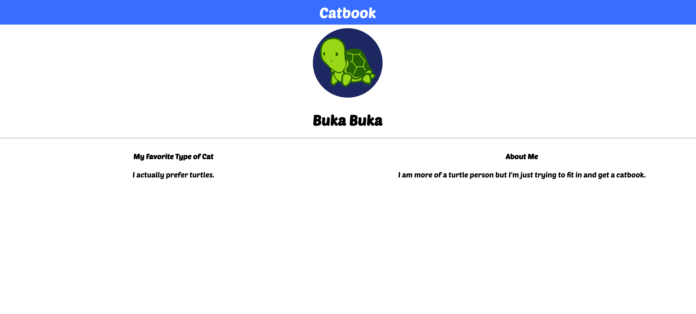

其中，字体需要从Google fonts 处获得，图片在文件夹的根目录里。

为了实现这个目标，我们还是从最基本的开始，即先构建html的骨架

## step1 html 网页骨架的构建

~~~html
<!DOCTYPE html>
<html>
  <head>
    <title>Catbook</title>
  </head>

  <body>
      <h1>Catbook</h1>
      <h1 >Buka Buka</h1>
      <h4>About Me</h4>
      
I am more of a turtle person but I'm just trying to fit in and get a catbook.

      <h4>My Favorite Type of Cat</h4>
      
I actually prefer turtles.

  </body>
</html>

~~~

不难得到以下的一个全是标题和文字的最为朴素的网页：

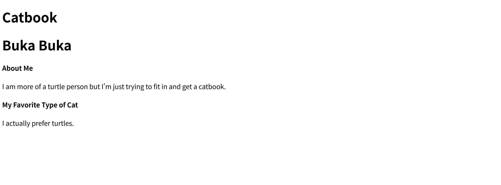

创建了一个名为catbook的网页(` <head><title>Catbook</title></head>`)，这个网页里包含2个大标题：`<h1>Catbook</h1>`和`<h1 >Buka Buka</h1>`，以及两个小标题`<h4>About Me</h4>`，最后是文字部分，通过`
I actually prefer turtles.
`的形式实现

## step2 插入图片

在原本的代码上我们插入一行``表示使用这个图像，如果图像加载不出来就用字符串`A cute cat`代替

~~~html
<!DOCTYPE html>
<html>
  <head>
    <title>Catbook</title>
  </head>

  <body>
      <h1>Catbook</h1>
      
      <h1 >Buka Buka</h1>
      <h4>About Me</h4>
      
I am more of a turtle person but I'm just trying to fit in and get a catbook.

      <h4>My Favorite Type of Cat</h4>
      
I actually prefer turtles.

  </body>
</html>

~~~

以下是图裂了的情况👇：

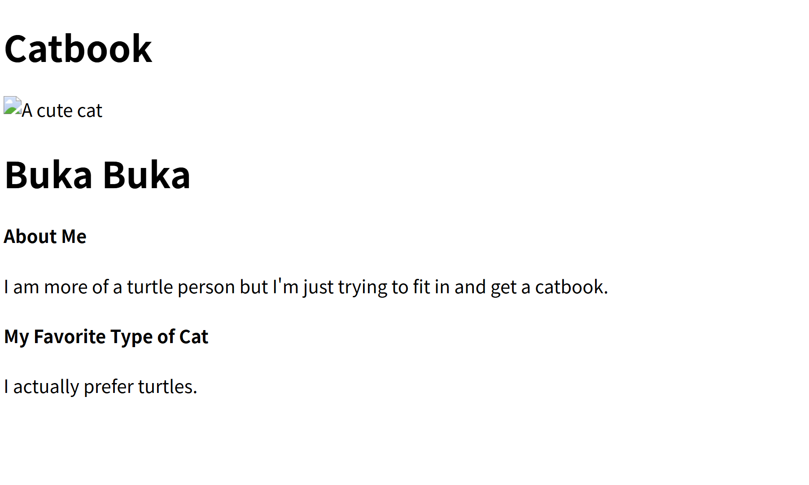

以下是图片正常加载的情况👇：

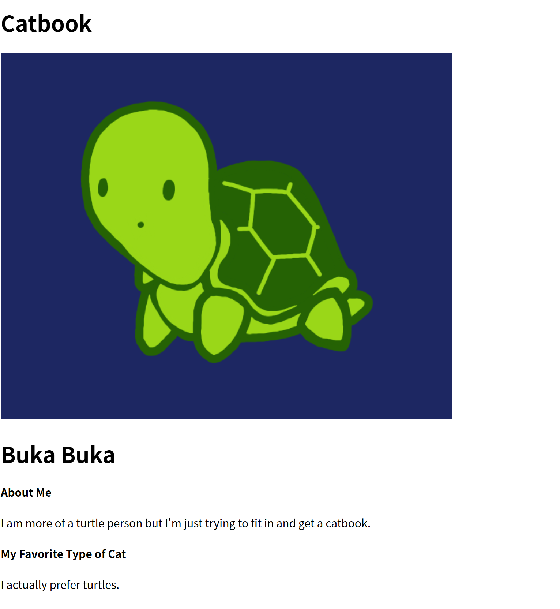

## step3 将这些简介字体都居中

为了调整这这些简介和标题的字，我们需要使用css的方式来进行美化，一般css文件命名为style.css 存放在和html平行的目录，为了更加方便的对每一个元素进行操控，我们可以通过对标签添加类的方式然后在css中对类的格式进行修改调整来实现美化，需要注意的是，使用css后需要在html中引入css文件：`<link rel="stylesheet" herf="./styles.css">`

~~~html
<!DOCTYPE html>
<html>
  <head>
    <title>Catbook</title>
    <link rel="stylesheet" href="./styles.css" />
  </head>

  <body>
    <h1>Catbook</h1>
    
    <h1 class="u-textCenter">Buka Buka</h1>
    <h4>About Me</h4>
    
I am more of a turtle person but I'm just trying to fit in and get a catbook.

    <h4>My Favorite Type of Cat</h4>
    
I actually prefer turtles.

  </body>
</html>

~~~

然后在styles.css中创建一个类：

~~~css
.u-textCenter {
  text-align: center;
}

~~~

使用text-align来居中对应类

最终结果如下所示：

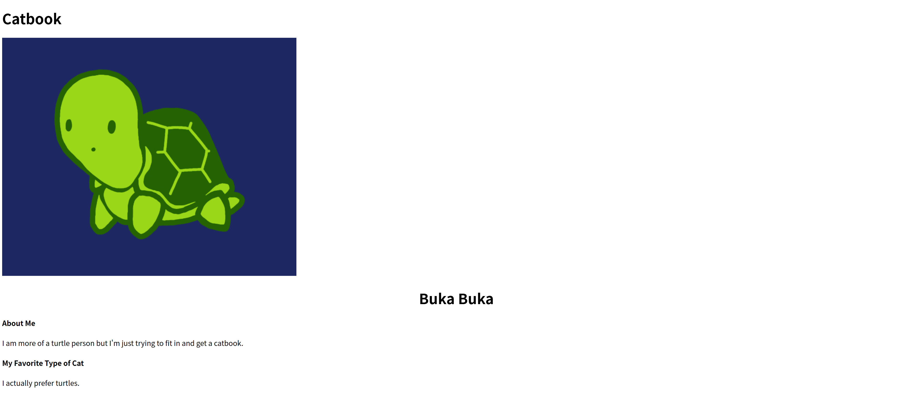

下面的字体同理，为了把下面的字体统一调控，我们可以把他们都放置在同一个section之下，然后让这个section也有上述的u-textCenter类

~~~html
<!DOCTYPE html>
<html>
  <head>
    <title>Catbook</title>
    <link rel="stylesheet" href="./styles.css" />
  </head>

  <body>
    <h1>Catbook</h1>
    
    <h1 class="u-textCenter">Buka Buka</h1>
    <section class="u-textCenter">
      <h4>About Me</h4>
      
I am more of a turtle person but I'm just trying to fit in and get a catbook.

      <h4>My Favorite Type of Cat</h4>
      
I actually prefer turtles.

    </section>
  </body>
</html>

~~~

其效果如下图所示

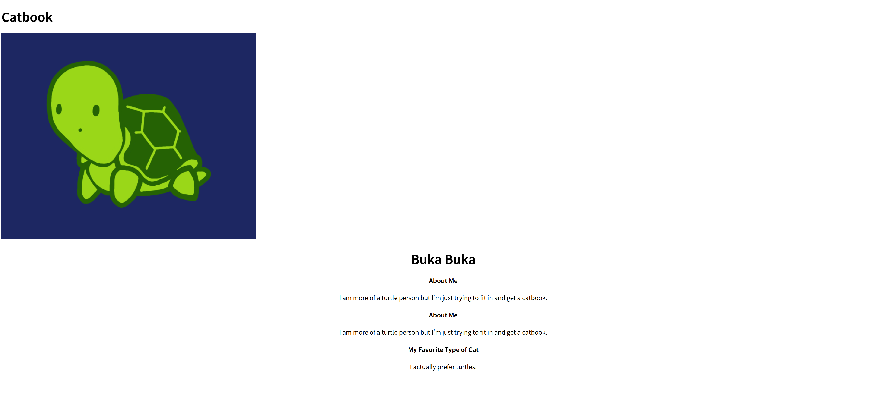

## step4 修改字体

修改字体较为简单，在[Google fonts](https://fonts.google.com/)中挑选合适的字体之后，将其对应的代码拷贝后放入header的部分

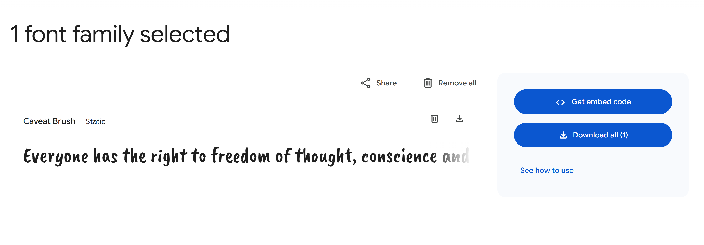

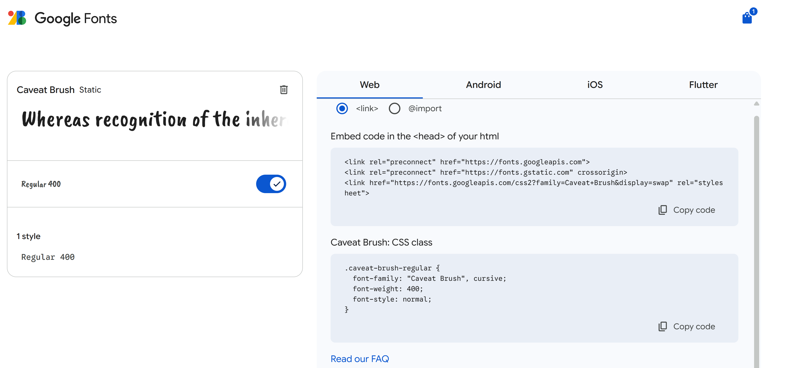

拷贝之后就可以直接在css里设置你想设置的对象的字体，这里我们将整个body的字体都设置成一样的字体：

~~~css
.u-textCenter {
  text-align: center;
}
body {
  font-family: "Poetsen One", sans-serif;
  font-weight: 400;
  font-style: normal;
}

~~~

然后是html文件：

~~~html
<!DOCTYPE html>
<html>
  <head>
    <title>Catbook</title>
    <link rel="stylesheet" href="./styles.css" />
    <link rel="preconnect" href="https://fonts.googleapis.com" />
    <link rel="preconnect" href="https://fonts.gstatic.com" crossorigin />
    <link
      href="https://fonts.googleapis.com/css2?family=Poetsen+One&display=swap"
      rel="stylesheet"
    />
  </head>

  <body>
    <h1>Catbook</h1>
    
    <h1 class="u-textCenter">Buka Buka</h1>
    <section class="u-textCenter">
      <h4>About Me</h4>
      
I am more of a turtle person but I'm just trying to fit in and get a catbook.

      <h4>My Favorite Type of Cat</h4>
      
I actually prefer turtles.

    </section>
  </body>
</html>

~~~

可以看到所有的字体都被改变成如下的样子

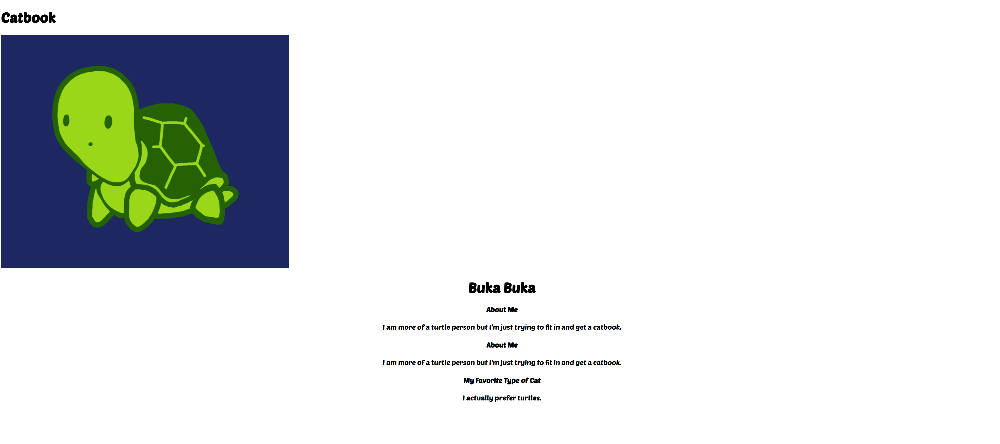

## step5 添加navbar 

我们的目标最上面的catbook 标题是有横幅的，在这称之为navbar，我们可以创建一个`nav`标签，将catbook标题包含在内，最后再在css中设置navbar的style 即可

~~~html
<!DOCTYPE html>
<html>
  <head>
    <title>Catbook</title>
    <link rel="stylesheet" href="./styles.css" />
    <link rel="preconnect" href="https://fonts.googleapis.com" />
    <link rel="preconnect" href="https://fonts.gstatic.com" crossorigin />
    <link
      href="https://fonts.googleapis.com/css2?family=Poetsen+One&display=swap"
      rel="stylesheet"
    />
  </head>

  <body>
    <nav class="navContainer">
      <h1 class="navTitle">Catbook</h1>
    </nav>
    
    <h1 class="u-textCenter">Buka Buka</h1>
    <section class="u-textCenter">
      <h4>About Me</h4>
      
I am more of a turtle person but I'm just trying to fit in and get a catbook.

      <h4>My Favorite Type of Cat</h4>
      
I actually prefer turtles.

    </section>
  </body>
</html>

~~~

那么我们只需要调整`navTitle`对象的字体就行了，这里可以在css文件中设置

~~~css
.u-textCenter {
  text-align: center;
}
body {
  font-family: "Poetsen One", sans-serif;
  font-weight: 400;
  font-style: normal;
}
.navTitle {
  font-family: "Poetsen One", sans-serif;
  font-weight: 400;
  margin: 0;
  font-size: 2rem;
  text-align: center;
  color: var(--primary);
}
:root {
  --primary: #396dff;
  --grey: #f7f7f7;
  --white: #ffffff;
}

~~~

这里我们在root处设置一些常见的颜色方便其他元素调用，这里的margin则是为了将浏览器的外边距设置为0

这是没设置外边距为0的：

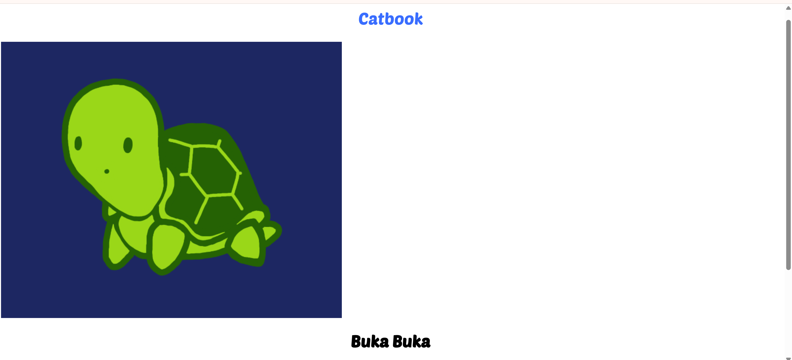

这是设置后的：

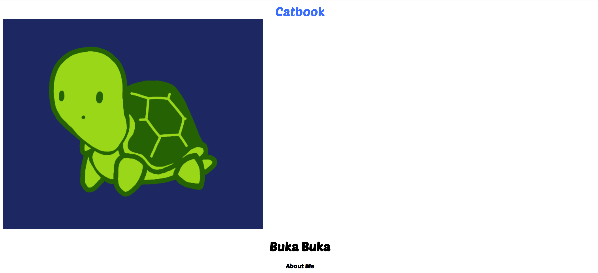

可以看出整个内容更为紧凑，从而方便对navbar进行调控

## step6 设置调整navbar

注意到我们的目标navbar是一个蓝底白字的，所以我们需要把`navTitle`设置成白色，同时还要把`navContainer`设置成蓝色，很容易通过设置styles.css实现

~~~css
.u-textCenter {
  text-align: center;
}
body {
  font-family: "Poetsen One", sans-serif;
  font-weight: 400;
  font-style: normal;
}
.navTitle {
  font-family: "Poetsen One", sans-serif;
  font-weight: 400;
  margin: 0;
  font-size: 2rem;
  text-align: center;
  color: var(--white);
}
.navContainer {
  background-color: var(--primary);
}
:root {
  --primary: #396dff;
  --grey: #f7f7f7;
  --white: #ffffff;
}

~~~

但其结果如下：

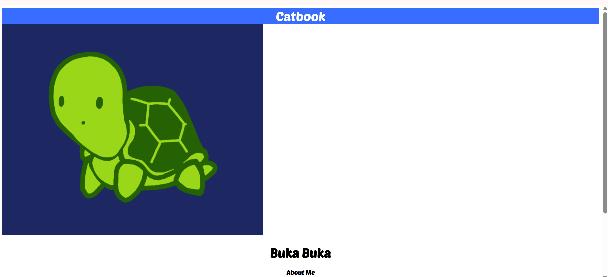

可以看到他和浏览器的书签栏有一个明显的白色间隔，这就是`margin`，所以我们还需要将`margin`设置为0,这里设置的是`body`对象的`margin`

~~~css
.u-textCenter {
  text-align: center;
}
body {
  font-family: "Poetsen One", sans-serif;
  font-weight: 400;
  font-style: normal;
  margin: 0 0;
}
.navTitle {
  font-family: "Poetsen One", sans-serif;
  font-weight: 400;
  margin: 0;
  font-size: 2rem;
  text-align: center;
  color: var(--white);
}
.navContainer {
  background-color: var(--primary);
  padding: 8px 16px;
}
:root {
  --primary: #396dff;
  --grey: #f7f7f7;
  --white: #ffffff;
}

~~~

除此之外，这里还设置了一个padding。设置padding可以使得文字和边框有一定的边距，这里设置的上下边距是8px左右边距是16px

最终的设置结果如下所示：

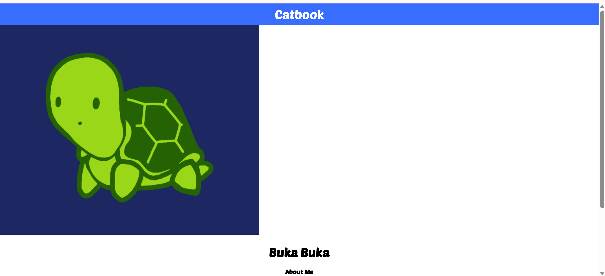

发现已经没有了白条

## step7 处理图像

我们为了处理图像，当然也需要对图像所在标签添加一个class然后对这个class的css进行调整：

~~~html
<!DOCTYPE html>
<html>
  <head>
    <title>Catbook</title>
    <link rel="stylesheet" href="./styles.css" />
    <link rel="preconnect" href="https://fonts.googleapis.com" />
    <link rel="preconnect" href="https://fonts.gstatic.com" crossorigin />
    <link
      href="https://fonts.googleapis.com/css2?family=Poetsen+One&display=swap"
      rel="stylesheet"
    />
  </head>

  <body>
    <nav class="navContainer">
      <h1 class="navTitle">Catbook</h1>
    </nav>
    
    <h1 class="u-textCenter">Buka Buka</h1>
    <section class="u-textCenter">
      <h4>About Me</h4>
      
I am more of a turtle person but I'm just trying to fit in and get a catbook.

      <h4>My Favorite Type of Cat</h4>
      
I actually prefer turtles.

    </section>
  </body>
</html>

~~~

这里将图像的`class`命名为`avatat`，接下来我们去styles.css 中调整`avatar`对象的属性：

为了将图像变圆，我们需要使用`border-radius`来调整，一般来说我们还可以在root里设置几个挡位例如16px，8px，4px，2px，32px

~~~css
.u-textCenter {
  text-align: center;
}
body {
  font-family: "Poetsen One", sans-serif;
  font-weight: 400;
  font-style: normal;
  margin: 0 0;
}
.navTitle {
  font-family: "Poetsen One", sans-serif;
  font-weight: 400;
  margin: 0;
  font-size: 2rem;
  text-align: center;
  color: var(--white);
}
.navContainer {
  background-color: var(--primary);
  padding: 8px 16px;
}
:root {
  --primary: #396dff;
  --grey: #f7f7f7;
  --white: #ffffff;
  --m: 16px;
  --s: 8px;
  --xs: 4px;
  --l: 24px;
  --xl: 32px;
}
.avatar {
  border-radius: 50%;
}

~~~

这里设置比例为50%，设置结果如下:

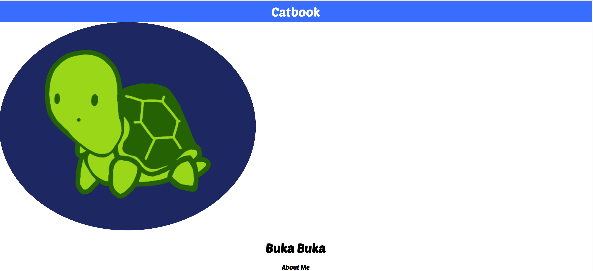

可以看到是个椭圆形，这是因为我们没有设置其长宽相等，而且整个头像也太大了，我们可以通过width和height来缩放，再通过`aspect-ratio: 1/1;`设置长宽相等，同时还可以把margin和padding设置好：

~~~css
.avatar {
  width: 10%;
  height: 10%;
  border-radius: 50%;
  aspect-ratio: 1/1;
  margin: auto;
  padding: 8px 16px;
}

~~~

这是设置完之后的结果👇

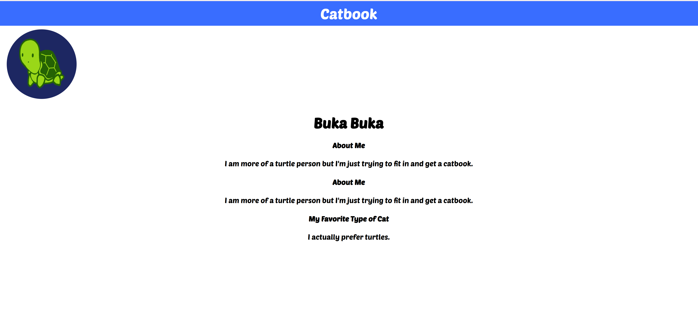

这里还需要加入  `object-fit: cover;` 和` display: block;`，前者控制图像放缩的方式是拉伸还是裁剪，后者则是把对象变成了一个block，其结合`margin: auto`实现图像的居中。

~~~css
.u-textCenter {
  text-align: center;
}
body {
  font-family: "Poetsen One", sans-serif;
  font-weight: 400;
  font-style: normal;
  margin: 0 0;
}
.navTitle {
  font-family: "Poetsen One", sans-serif;
  font-weight: 400;
  margin: 0;
  font-size: 2rem;
  text-align: center;
  color: var(--white);
}
.navContainer {
  background-color: var(--primary);
  padding: 8px 16px;
}
:root {
  --primary: #396dff;
  --grey: #f7f7f7;
  --white: #ffffff;
  --m: 16px;
  --s: 8px;
  --xs: 4px;
  --l: 24px;
  --xl: 32px;
}
.avatar {
  width: 10%;
  height: 10%;
  border-radius: 50%;
  aspect-ratio: 1/1;
  margin: auto;
  object-fit: cover;
  display: block;
  padding: 8px 16px;
}

~~~

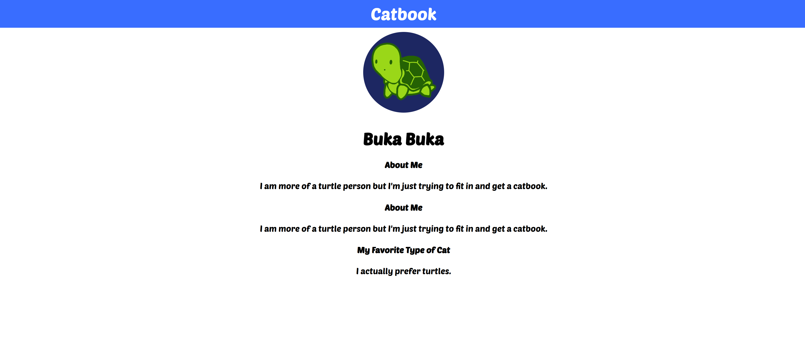

注意到bukabuka下面还有个分割线，我们在html里用`
`实现

~~~html
<!DOCTYPE html>
<html>
  <head>
    <title>Catbook</title>
    <link rel="stylesheet" href="./styles.css" />
    <link rel="preconnect" href="https://fonts.googleapis.com" />
    <link rel="preconnect" href="https://fonts.gstatic.com" crossorigin />
    <link
      href="https://fonts.googleapis.com/css2?family=Poetsen+One&display=swap"
      rel="stylesheet"
    />
  </head>

  <body>
    <nav class="navContainer">
      <h1 class="navTitle">Catbook</h1>
    </nav>
    
    <h1 class="u-textCenter">Buka Buka</h1>
    

    <section class="u-textCenter">
      <h4>About Me</h4>
      
I am more of a turtle person but I'm just trying to fit in and get a catbook.

      <h4>My Favorite Type of Cat</h4>
      
I actually prefer turtles.

    </section>
  </body>
</html>

~~~

结果如下：

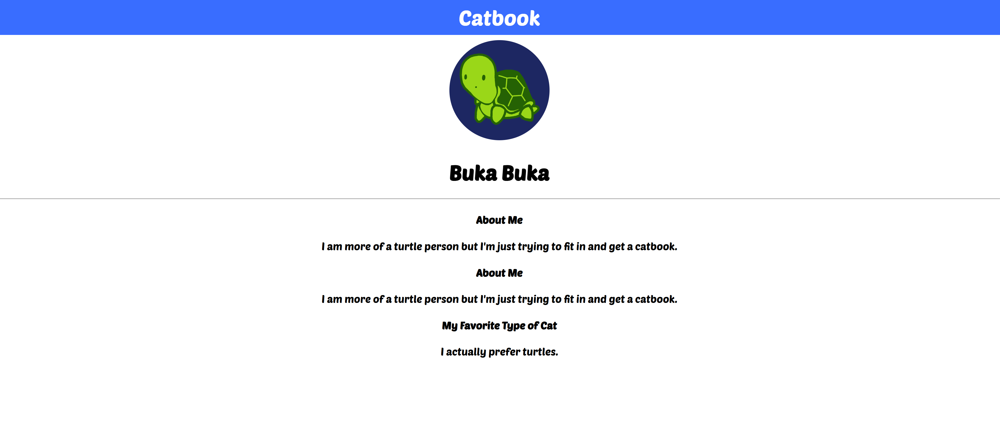

## step8 处理文字分栏

为了实现布局，这里使用的是一维布局工具flex，我们需要布局的就是以下的部分

~~~html
<section class="u-textCenter">
      <h4>About Me</h4>
      
I am more of a turtle person but I'm just trying to fit in and get a catbook.

      <h4>My Favorite Type of Cat</h4>
      
I actually prefer turtles.

</section>
~~~

我们可以把整个部分放在flex容器中，每一个小part是flex的一个子容器，一个子容器存放about me 一个子容器存放My Favorite Type of Cat

~~~html

    <section class="u-textCenter">
    	<h4>About Me</h4>
        
I am more of a turtle person but I'm just trying to fit in and get a catbook.

    </section>
    <section class="u-textCenter">
    	<h4>My Favorite Type of Cat</h4>
        
I actually prefer turtles.

    </section>    

~~~

而父容器需要开启flex，对应于css文件中的`display:flex;`

而且由于我们的about子容器（子容器1）在favorite子容器（子容器2）之前，我们希望布局是子容器2在左，子容器1在右，而默认的flex布局`row`是从左往右布局：【子容器1】 【子容器2】，所以我们布局要反过来`row-reverse`

~~~
.u-flex {
  display: flex;
  flex-direction: row-reverse;
}
~~~

经过上述之后得到如下的结果：

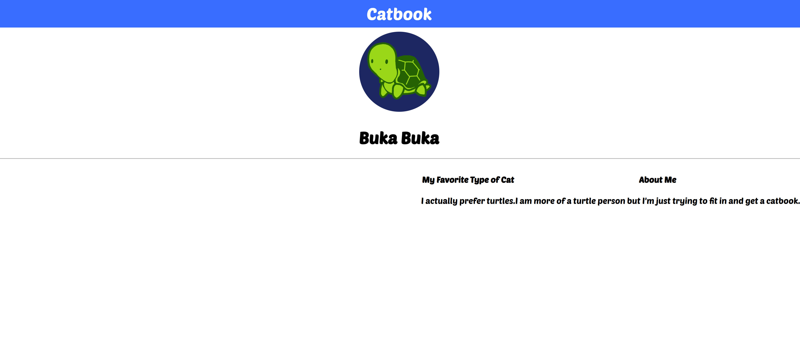

这是因为我们只设置了flex容器内的排序，没有设置两个子容器的格式和布局

我们需要设置子容器的起始位置为0(表示定格)，子容器的尺寸保持一致，都是一样，那么我们只需要对`.subContainer`进行设置，那么两个子容器都符合相同的类的约束

~~~css
/* Your Code Here! */

.u-textCenter {
  text-align: center;
}
body {
  font-family: "Poetsen One", sans-serif;
  font-weight: 400;
  font-style: normal;
  margin: 0 0;
}
.navTitle {
  font-family: "Poetsen One", sans-serif;
  font-weight: 400;
  margin: 0;
  font-size: 2rem;
  text-align: center;
  color: var(--white);
}
.navContainer {
  background-color: var(--primary);
  padding: 8px 16px;
}
:root {
  --primary: #396dff;
  --grey: #f7f7f7;
  --white: #ffffff;
  --m: 16px;
  --s: 8px;
  --xs: 4px;
  --l: 24px;
  --xl: 32px;
}
.avatar {
  width: 10%;
  height: 10%;
  border-radius: 50%;
  aspect-ratio: 1/1;
  object-fit: cover;
  display: block;
  margin-left: auto;
  margin-right: auto;
  padding: 8px 16px;
}
.u-flex {
  display: flex;
  flex-direction: row-reverse;
}
.subContainer {
  flex-grow: 1;
  flex-basis: 0;
}

~~~

~~~html
<!DOCTYPE html>
<html>
  <head>
    <title>Catbook</title>
    <link rel="stylesheet" href="styles.css" />
    <link rel="preconnect" href="https://fonts.googleapis.com" />
    <link rel="preconnect" href="https://fonts.gstatic.com" crossorigin />
    <link
      href="https://fonts.googleapis.com/css2?family=Poetsen+One&display=swap"
      rel="stylesheet"
    />
  </head>

  <body>
    <nav class="navContainer">
      <h1 class="navTitle">Catbook</h1>
    </nav>
    

    <h1 class="u-textCenter">Buka Buka</h1>
    

    

      <section class="u-textCenter subContainer">
        <h4>About Me</h4>
        
I am more of a turtle person but I'm just trying to fit in and get a catbook.

      </section>
      <section class="u-textCenter subContainer">
        <h4>My Favorite Type of Cat</h4>
        
I actually prefer turtles.

      </section>
    

  </body>
</html>

~~~

如果要设置两个子容器的尺寸比例不一致，那就得分别设置两个class，class1的flex-grow是1，class2的flex-grow是2这种。这里的flex-grow绝对数值意义不大，重要的是在父容器中相较于其他子容器的占比，这将决定他的尺寸

最终结果如下图所示👇：

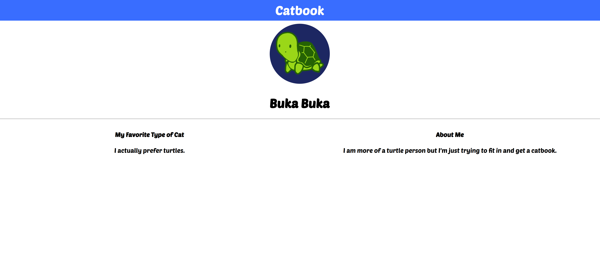

当然也可以访问以下网址：[here](https://junedrinleng.com/catbook0)
