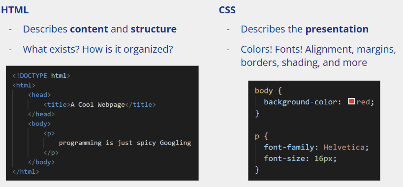
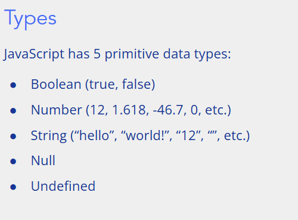
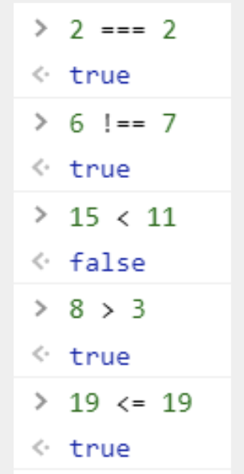
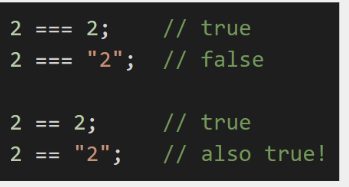
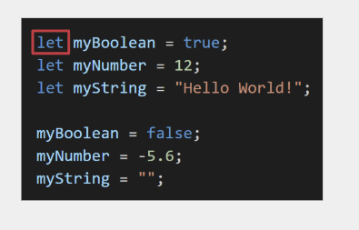
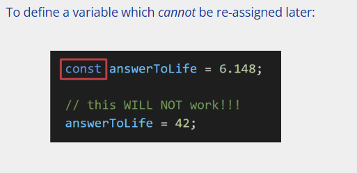
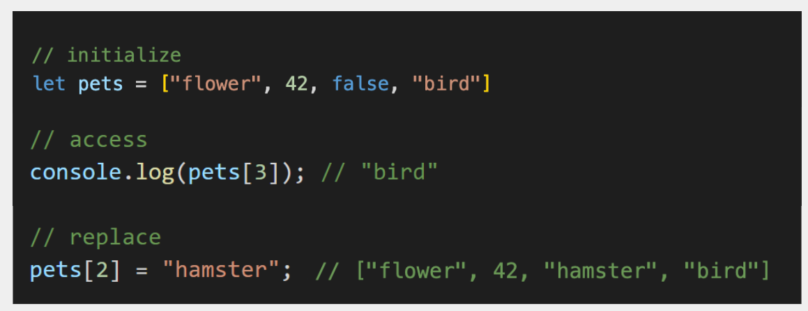

本笔记主要记录[MIT Web Development Crash Course](https://weblab.mit.edu/schedule)课程的笔记，本节主要记录的是第一节课程的JavaScript的部分，课程链接在[here](https://www.youtube.com/watch?v=OMuYHyBi-Ms&ab_channel=MITWebLab%286.962%29)

<!-- more -->

## 1 js简介

p.s. better for not fresh hand

JavaScript的目的是什么？

上节课已经学到了，html是网页的骨架，css是网页的装饰，那么js是用来解决什么的呢？

js类似于肌肉和器官来保证整个网页的顺利运行——操纵网页内容的程序语言，让网页富有交互性

运行的环境：浏览器的console，按住`ctrl+shift+j`

## 2 js的数据类型

需要注意的是，js没有float和int之分，所有的这些都被归结在number下

另一个需要考虑的是，js有Null和Undefined的两种tricky的东西

## 3 js的operator

对于`number`的加减乘除等操作是很正常的，另外对字符串的相加操作也是如常的，除此之外，对于Boolean的产生也是基本和python一致（不等于和等于是三个符号）。

**不难发现这里的判断是否相等用的是`===`，不相等则是用的`!==`**

这里需要讨论一下`==`和`===`的区别

对于一般的编程语言，一般都用`==`来判断这俩变量是否指向同一个内存地址，这个是在js中是通过`===`实现的，而一般的`==`在js里则进行的首先是type一致化的操作，然后再进行比较，这就会导致很多和直觉相左的结果：

例如这里的`2=="2"`就会先将`2`和`"2"`转换成相同类型，例如都转化为`"2"`然后再比较，这时两者是相等，所以返回的是`true`

由于上述机制的存在，所以我们比较时总是使用三重符号，而非双等号这种

## 4 js 基本语法

需要注意的是，每行语句的结尾都需要一个分号。与python不同的是，js是缩进不敏感的，对于代码块的分辨来源于大括号{}，注释则是通过//实现

对于js的变量定义，需要申明，使用`let`语句申明，同时变量的命名需要使用驼峰命名法才行，不建议使用下划线的命名方式

对于常量的定义则是通过`const`语句实现

为什么要有变量和常量之分？为了安全coding，防止某些常量被修改影响后续程序。如果试图要改变const常量，js回返回错误信息

需要注意的过去对于变量定义还有一个定义方式`var`，区别在于var的作用域是仅仅被函数限制的（函数内变量），而let的变量是被大括号所限制的

~~~javascript
for (let i = 0; i < 3; i++) {
  setTimeout(() => console.log(i), 100); // 0, 1, 2
}
//setTimeout是异步函数，如果是var的化，循环结束才会执行回调，此时回调是循环结束之后进行的也就说i全都是3了
~~~

~~~javascript
function test() {
  if (true) {
    var a = 123;
  }
  console.log(a); // 123，a 在整个函数内都可见
}

~~~

所以为了更清晰的变量作用域，请不要使用`var`

## 5 null和undefined

`undefined`表示没有分配内容，例如对于变量可以只声明而没赋值

`null`则表示的是没有值 

为了清楚的了解变量的值，我们可以使用`console.log()`的方式实现类似于`print`的效果

结构化字符串的实现：

~~~javascript
let a=1;
let b=2;
console.log(`a+b=${a+b}`);
~~~

另一种调试的方法是使用`alert`函数

## 6 array in js

在js中，array类似于python的list但是其中的元素可以是任何一种数据类型

