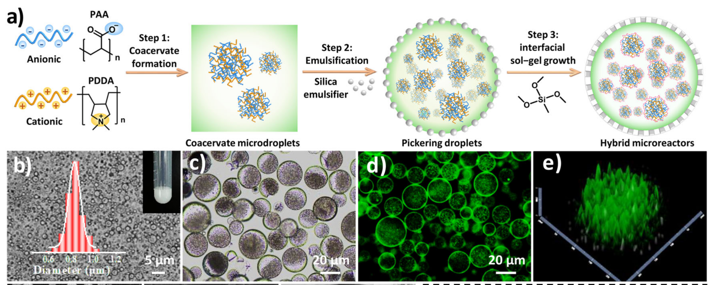
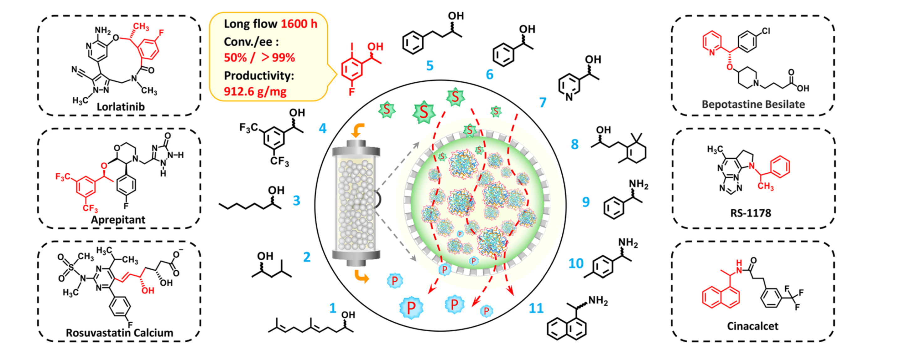
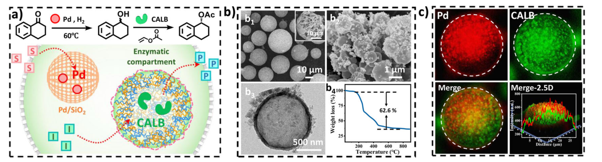
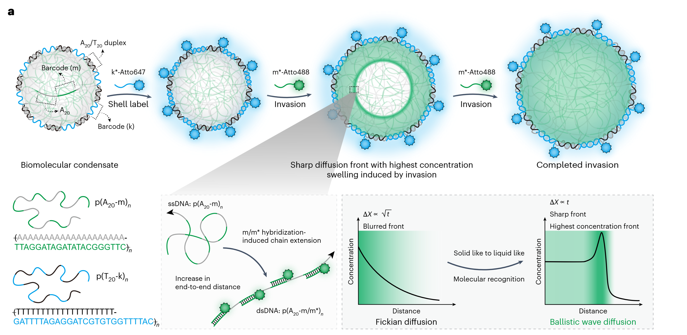
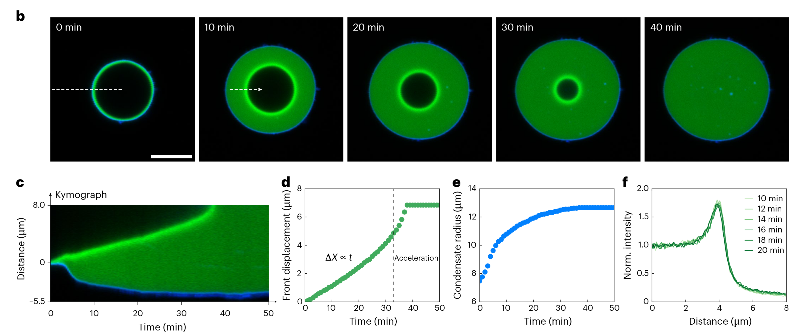
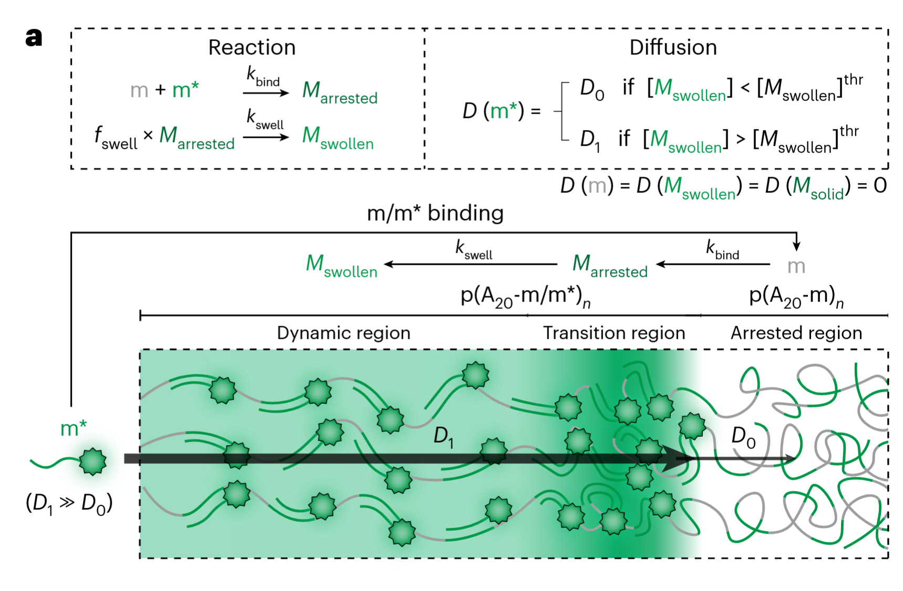

本笔记主要记录一种基于阴阳离子聚合形成的protocell液滴并用于酶催化，以及一篇报道液滴内部弹道扩散行为的文献

<!-- more -->

## 1 多室混合微反应器用于酶催化

> ref: X. Hao *et al.*, *Angew Chem Int Ed*, e202502479 (2025).

本文的策略即通过阴阳离子聚合物的电荷相互吸引形成类似于沉淀一样的团聚体，然后添加二氧化硅乳化剂来包裹这群团聚体，从而形成液滴，液滴如图b，c所示。其与之前所做的llps的应该实验接近，应该信号也是聚集于边界为主（也可能是因为外部这层硅氧化合物的壳的缘故）。  

构造完上述的微反应器后，文献又引入了不同的分子反应环境，例如：CLAB，GOx，HRP，NADH等等，对其时空异质性进行了表征，然后展现其反应的选择性：

下面是酶催化反应的机理图，同时他还探究了温度对离子聚合物的影响

## 2 生物分子凝聚体中的弹道扩散

> ref: W. Chen *et al.*, *Nat. Nanotechnol.*, 1–9 (2025).

整个液滴的形成是这样的，下面是$A_{20}/T_{20}$的共聚形成了外部是蓝色dna段，内部是绿色dna段的液滴。那么首先加入和蓝色dna连段结合的染料647，那么整个液滴的边界就被647染料给标记上了，之后再加入绿色的488染料，可以发现绿色呈现从圆周向圆心的径向向心扩散，直至整个液滴内部的绿色dna链段全部结合上488染料从而成绿色荧光。

这里的fickian diffusion就是布朗运动的宏观统计结果，而这里的ballistic wave 扩散则是我们所理解的：
$$
MSD=2D t^2
$$
其扩散指数$\alpha=2$，宏观上其扩散的表现如下图所示

这里的invasion实际上是染料分子的侵入：

