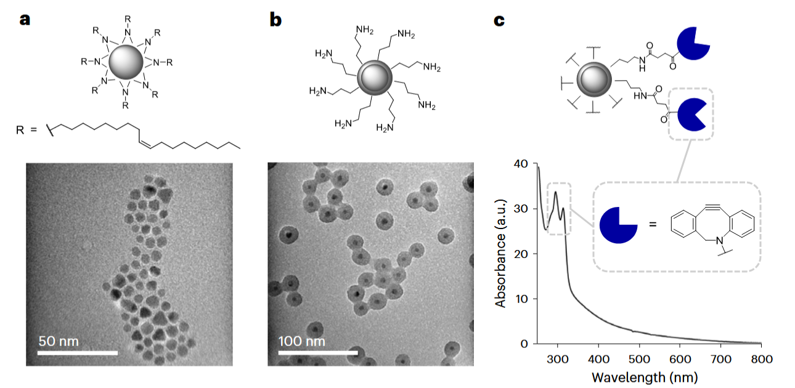
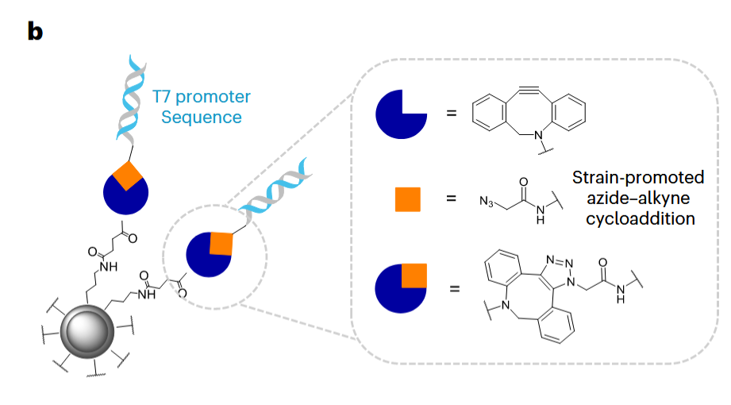
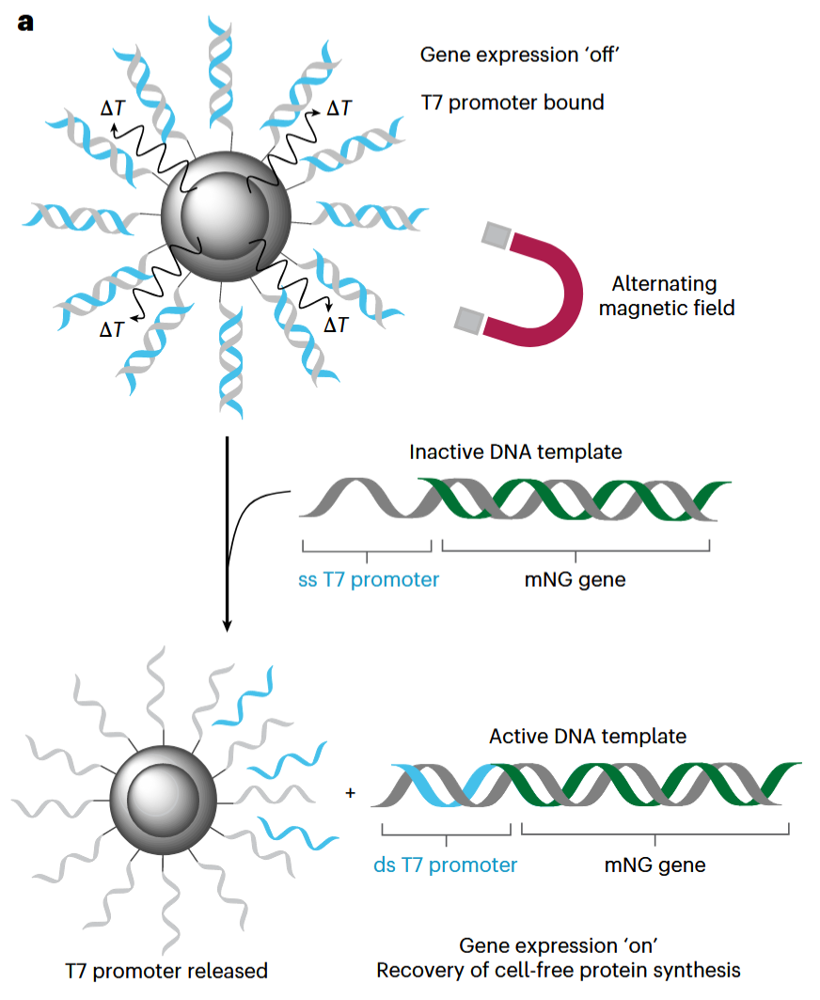
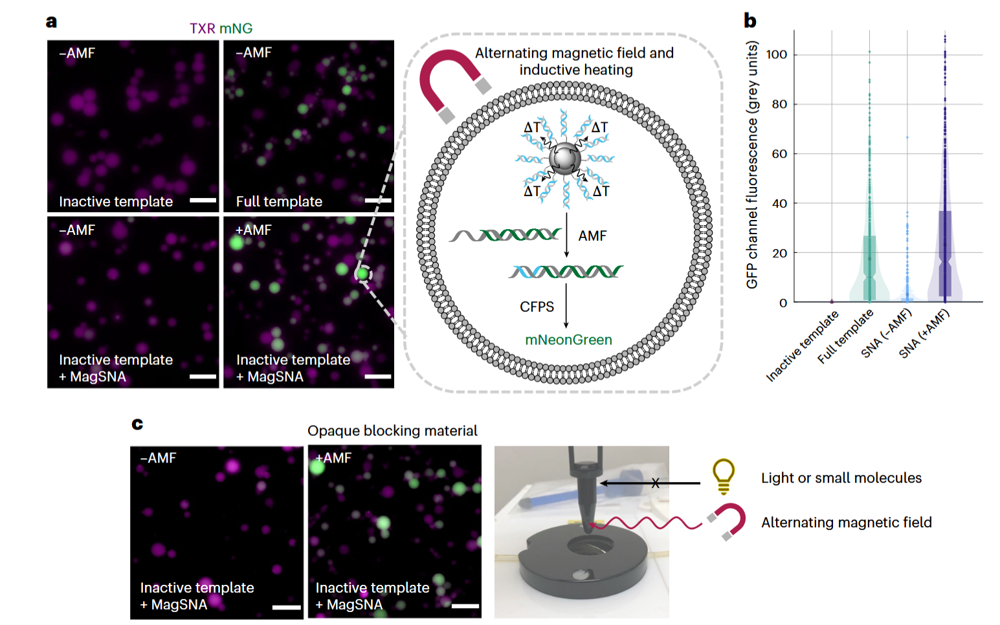
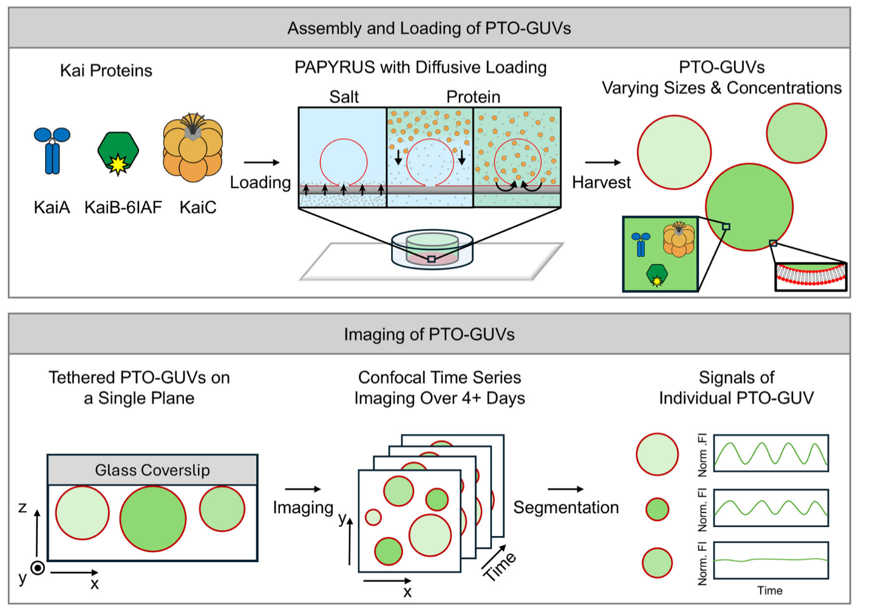
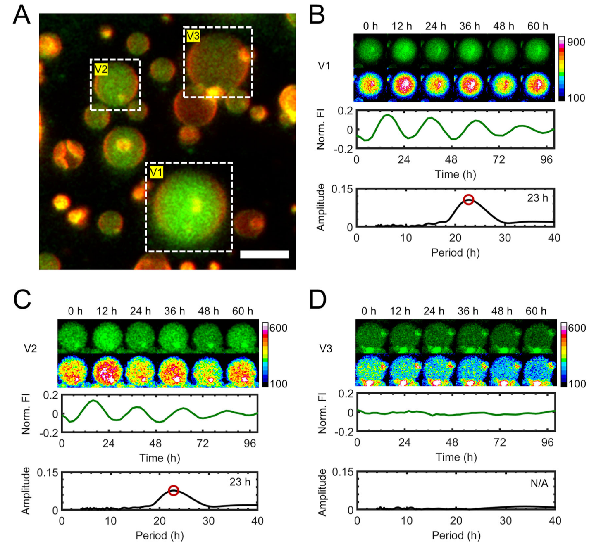
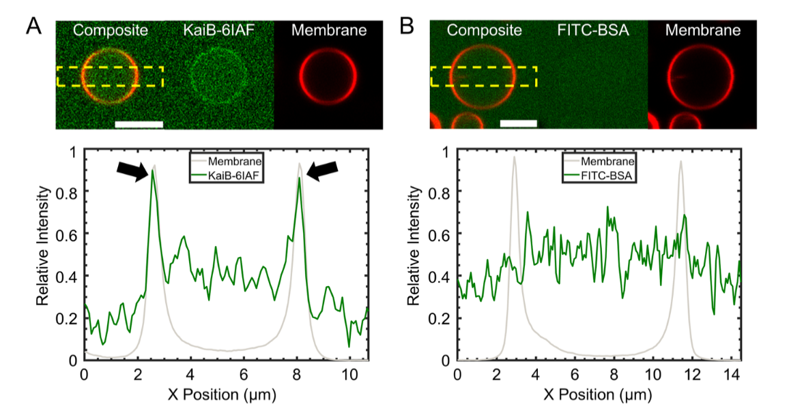
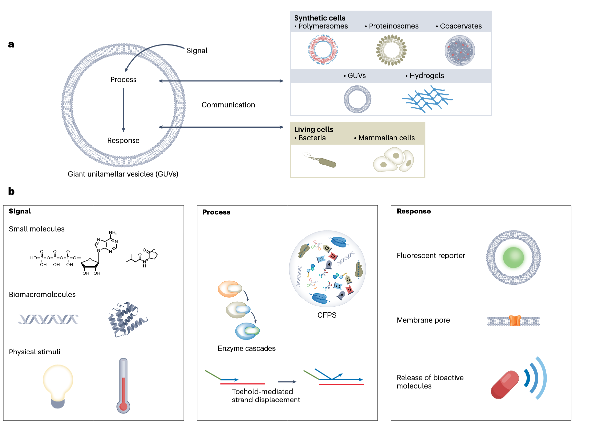

本笔记主要记录synthetic cells相关关键词的最近文献，包括一篇人工细胞综述，一篇通过磁性驱动dna反应，以及一篇巨型单层囊泡仿生细胞的昼夜节律模拟实验

<!-- more -->

## 1 球形核酸的磁激活可以实现对合成细胞的远程控制

> ref: E. Parkes *et al.*, *Nat. Chem.*, 1–9 (2025).

合成细胞中，能够模仿活细胞的结构和功能的脂质体囊泡正则成为一个较为火热的领域，其可以被用于药物递送等应用场景。

本文构造了一种类似于核壳结构的磁性纳米颗粒，其主要结构如下图所示：

这种**纳米颗粒的尺寸感觉很小**，不知道是图片的scale bar错了还是真就这么小。  

内部的球体有磁响应，外部的链段用于接上dna链以实现相关反应：

通过叠氮基的1，3偶极环加成实现。当外界引入交变磁场后，内部磁性颗粒的磁响应会使得颗粒的局部温度产生变化，从而能够改变修饰链段的活性，将dna链段接到底物上：  

实验中可以发现，通过外加磁场，使得本来内部呈现红色荧光的囊泡液滴，发生变化产生绿色的修饰后链段物，从而使得部分液滴呈现绿色

## 2 在合成细胞中重构生物钟揭示了守时的原理

> ref: A. Z. T. Li, A. LiWang, A. B. Subramaniam, *Nat Commun*. **16**, 6686 (2025).

整篇文献主要是从蛋白的翻译表达等生物学机制的角度进行的阐释，这篇文章的体系是：

通过将蛋白KaiA-C三种的溶液扩散进入正在生长的囊泡中，从而形成了囊泡包裹的多组分蛋白液滴，其拍摄的结果则如下图所示：

可以看到的是，在4天的实验区间内，v1和v2的液滴呈现出一定的周期节律。  

需要注意的是，这里荧光标记后的BSA（FITC-BSA）作为背景来测试syn-cell的膜是否有破洞和渗透的情况：

一般情况下，膜对于BSA这种其他蛋白应该是没有明显符集的，所以在B图中我们可以看到，空间上BSA几乎在视野中均匀的分布，从切面的荧光强度来看，液滴区域和液滴外的BSA的荧光强度也相差不大

## 3 合成细胞通信的策略与应用

> ref: H. Moghimianavval, C. Newell, P. Parvizian, M. J. Booth, A. P. Liu, *Nat Chem Biol*. **21**, 1317–1329 (2025).

这是一篇讲述仿生细胞间通讯的综述，我认为他在一定程度上也总结了仿生细胞的一些制作流派：

比如这张图中，就记录了合成细胞有高分子边界，蛋白形成的液滴边界，凝聚体形成的仿生液滴（例如9.2提到的阴阳离子聚合形成的凝聚体液滴），以及上文提到的脂质体囊泡以及早已为大家做了很多的水凝胶。   

这张图同时也汇总了一些常见的信号诸如小的信号分子（似乎是ATP），大的生物分子比如dna和蛋白，还有一些物理因素光热等等，通过这些信号引发一系列的过程，从而产生荧光/膜孔/生物活性分子的释放等效果。
