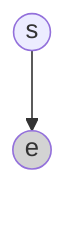

This note mainly introduces the local CPD part of Bayesian networks in probabilistic graphical models  
<!-- more -->

## 3.1 Review

Here, besides the independence of BC given AD, there is another independence condition: A is independent of D itself  
  

  

For (2), the graph satisfies the condition less than the probability condition in the question, which is reasonable. Here, the last two graphs satisfy the independence of B and C given AD. The left second graph adds an additional condition that A and D are independent (compared to the probability space)  
ps. Except for V-structure and causal relationships, arrows in Bayesian networks represent associations only  

## 3.2 Local Probabilistic Model - How to Represent Conditional Probability (CPD)

The more parent nodes, the more information needs to be provided for the child node to learn parent nodes  
Rule· CPD:  
  
$\rho1:<a^0,j^0;0.8>$, $\rho2:<a^0,j^1;0.2>$ represent two possibilities when a=0: j=0 and j=1 with probabilities 0.8 and 0.2 respectively  
The same graph model may have different specific situations, leading to different local CPDs for nodes  

## 3.3 Some Models

### 3.3.1 Noisy-Or Model

Example (Noisy-Or Model):  
• The failure rate of CPU is f1  

• The failure rate of MEM is f2  

• The failure rate of DISK is f3  

• The failure rate of POWER is f4  

• The failure rate of OS is f5  

• The failure rate of other events is f0  

• Question: the failure rate of your computer?  
The case where all work normally is:  
(1-f0)* (1-f1)* …… (1-f5)  
  
Under this model, different parent nodes can lead to the same child node result  

### 3.3.2 The Generalized Linear Models

$$
sigmoid(s)=\frac{e^s}{1+e^s}
$$
Logistic CPD:  
$$
P(Y=y^1 | X_1,……,X_k)=sigmoid(w_0+\sum w_i X_i)
$$
  

The effect of y is influenced by the linear combination of parent nodes + a shell (Gaussian distribution, Poisson distribution) to achieve it  
  
This approach is also implicitly used in neural networks. Each neuron's input is the weighted sum of parent nodes from the previous layer ($w_0+\sum w_iX_i$) - the number of parent nodes + 1 is the parameter count (considering $w_0$)  
  

The first layer has no parent nodes, so it has 3x1 parameters  
The second layer each node has three parent node weights + $w_0$ weight, so each node has four parameters, four nodes have 4x4 parameters  
The third layer each node has four parent node weights + one $w_0$ weight, so each node has five parameters, with 2x5 parameters total  
Total: 3x1 + 4x4 + 2x5  

### 3.3.3 Pooling Function
max pooling has translation invariance; median pooling is for noise resistance  
  

## 3.4 Bayesian Network Graphical Example

eg1. Cancer is a general term encompassing many types of diseases. For example, breast cancer has four main subtypes: normal type, basal type, Luminal A type, and Luminal B type, which have different clinical outcomes. Each subtype has distinct gene expression patterns. We need to infer the subtype based on observed gene expressions.  

**First, determine variables:**  
Variables: subtypes (s), gene expressions (e)  
**Second, determine the relationships between random variables:**  
Subtypes define the patterns of expressions  

  

Boxes represent independent and identically distributed (i.i.d.) repeated structures. Repeating N times requires only writing N in the bottom-right corner  
The Bayesian network has been established. It is recommended to check the Bayesian network before local CPD  
**Now, determine the local CPD**  
   
Assume the local CPD of s satisfies a multinomial distribution, and e satisfies a Gaussian distribution under the condition of s. Note that parameters like $\pi$ are not nodes and do not need to be circled  
At this point, we can write the complete probability model by combining the local CPD and Bayesian network  
$$
p\left(s=k,e\right)=P\left(s=k\right)p\left(e\mid s=k\right)\\=\pi_k\times\frac{\exp\left(-\frac12\left(e-\mu_k\right)^T\Sigma_k^{-1}\left(e-\mu_k\right)\right)}{\sqrt{\left(2\pi\right)^k\left|\Sigma_k\right|}}
$$

For each unit:  
$$
p(S, E)=\prod_{n=1}^N p(s[n]=k, \boldsymbol{e}[n])
$$

eg2. Cancer is typically caused by independent driving processes (factors), such as sustained proliferation, resistance to cell death, immune evasion, and promotion of angiogenesis.  
• These driving processes jointly affect gene expression patterns.  
• We aim to infer these driving processes based on large-scale gene expression datasets.  

First, determine variables:  
Driving factors ($z_i$ ), gene expressions ($e_j$ )  
Second, determine relationships  
z determines the distribution of e  
Modeling:  
  

eg3. More complex scenarios involve parameters also being random variables determined by other parameters  
  

## 3.4 Conclusion

Three Steps for Representation:  
• Define nodes / variables  
• Consider edges / dependences  
• Choose local CPDs